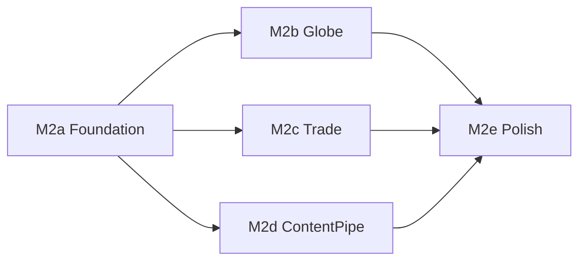

# 《环球航商》iOS Expo — 下一里程碑需求规格

| 字段 | 内容 |
|------|------|
| 文档编号 | REQ-ios-expo-M2 |
| 版本 | v0.1（初稿） |
| 产品 | 《环球航商》/ Airborne Trader |
| 目标工程 | [`ios/expo/`](../ios/expo/)（Expo Go SDK 54 · 12 枢纽 Demo） |
| 关联 | [PRD_01.md](../PRD_01.md)；[v0.2_REQUIREMENTS.md](v0.2_REQUIREMENTS.md)（Godot 主线，内容对齐参考）；[ios/expo/README.md](../ios/expo/README.md)；[ios/github.md](../ios/github.md) |
| 前置里程碑 | **M1（已交付）**：审阅优化 — 真实登机倒计时与自动起飞、行李随票失效、购买校验与加权成本、时钟隔离、AsyncStorage 存档、成就 toast、Reduce motion、safe-area |
| 状态 | 需求起草 |

本文档定义 **iOS Expo Demo 的 M2 里程碑**：在 M1 已可玩、可存档的闭环上，补齐「可感知的地球」、贸易深度、内容管线与可发布质量，使手机版从「设计稿可玩移植」升级为「可持续迭代的移动 Demo」。

与 Godot [`docs/v0.2_REQUIREMENTS.md`](v0.2_REQUIREMENTS.md) 的关系：

- **玩法与内容语义**尽量对齐（定价、枢纽、成就口径）；
- **表现与工程**独立于 Godot（React Native / Expo）；
- 冲突时：移动端以本文件为准，桌面主线以 PRD / v0.2 为准。

---

## 1. 背景与目标

### 1.1 M1 已交付回顾

| 域 | 已交付 | 仍薄弱 |
|----|--------|--------|
| 核心循环 | 买 → 订票 → 倒计时/加速 → 过场 → 落地卖出 | 只能「全部卖掉」；无法部分出售/丢弃 |
| 时间与登机 | `depMin` 真实等待；到点强制起飞；Speed up | 无「距起飞 &lt;2h 灰显 / 默认聚焦下一班」 |
| 行李 | 加购随票；落地重置 23 kg | 落地超重无明确处置文案；cargo 与 carry-on 策略仍粗 |
| 存档 | AsyncStorage 节流读写 | 无多存档槽、无导出/清除确认分级、无版本迁移测试 |
| 地球 | 静态 `earth.png` + 城市 chip | **不可旋转、无航线弧、无点选枢纽**（与 PRD「可旋转地球」差距最大） |
| 市场情报 | 有 hot/ok/cold 标签（持票时） | 无付费精准预测；无价格历史 sparkline |
| 内容 | 手写 `gameData.js` 12 城 | 未接 ETL；扩城靠手工 `require()` |
| 反馈 | Toast + 成就 toast | 无 SFX / 触感；出售无分级反馈 |
| 平台 | Expo Go、safe-area、Reduce motion | 无 EAS / TestFlight；无自动化测试 |

### 1.2 M2 目标一句话

让玩家在真机上 **转地球选城、带着情报做一笔完整买卖、进度可靠保存**，并为后续扩到 20–30 枢纽打通 **内容导出管线**；质量上达到「可发给外部试玩」的标准（崩溃率、存档安全、基础无障碍）。

### 1.3 成功标准（产品层）

1. 地球页可拖转（或等效浏览）并点选枢纽，当前城与目的地有视觉区分；持票时显示本段大圆弧（静态或简易动画均可）。
2. 行李页支持 **按条目出售 / 丢弃**；落地超重有明确提示与处置路径。
3. 市场在持票状态下情报可读性不低于 M1，并新增 **至少一种深度情报**（见 §4）。
4. 存档支持 **版本号迁移** 与「清除存档」二次确认；冷启动恢复后时钟与机票状态一致。
5. 至少 **一条** 从 `etl/`（或现有 `hubs_*.yaml`）到 `ios/expo` 的内容导出路径可重复跑通；新增一座枢纽的手工步骤 ≤ 文档中的 checklist。
6. 提供 EAS 开发构建或 TestFlight 内测包说明；核心回路有不少于 8 条自动化断言（逻辑层，不强制 UI 快照）。

---

## 2. 范围边界

### 2.1 纳入（In Scope）— M2

| # | 能力 | 优先级 | 说明 |
|---|------|--------|------|
| G1 | 可交互地球（旋转 / 惯性 + 枢纽锚点） | P0 | 替换「拖不动的地球」文案与体验 |
| G2 | 持票大圆弧 + 起降点高亮 | P0 | 强化「在飞哪一段」的空间感 |
| T1 | 库存部分出售 / 丢弃 | P0 | 打破「只能 Sell everything」 |
| T2 | 落地超重处置 | P1 | 提示 + 引导去 Bags 或强制打开出售 |
| T3 | 市场深度情报（二选一或都做轻量版） | P1 | 见 §4.2 |
| S1 | 存档版本迁移 + 清除确认 | P0 | 防坏档；防误触 Restart |
| S2 | 逻辑层单测 / 小型测试脚手架 | P0 | 定价、登机等待、存档 round-trip |
| C1 | ETL → Expo 内容导出（12→可扩） | P1 | 与 `tools/export_ios_data.py` 等对齐 |
| C2 | 枢纽扩至 **16–20**（可选冲刺） | P2 | 有管线后再扩；否则维持 12 |
| A1 | 关键操作触感（购票、起飞、成交） | P2 | `expo-haptics` |
| A2 | 最小 SFX 包（3–5 个） | P2 | 可选；无音频亦可验收 G/T/S |
| P1 | EAS Build / 内测分发文档 | P1 | 不强制上架 App Store |
| U1 | 航班列表「下一班」默认排序与即将起飞提示 | P1 | 对齐桌面航班 UX 的一小部分 |

### 2.2 明确不纳入（Out of Scope → M3 / 主线 v0.2）

| 项 | 归属 |
|----|------|
| 500+ 城、全球商业机场、中转联程 | Godot v0.2 / 移动 M3+ |
| 真实航司 Logo、实时航班、联网票价 | 永不进 Demo |
| App Store 正式上架、IAP、账号系统 | M3+ |
| 完整 i18n（UI 多语言） | M3；本版 UI 保持英文（与当前 Expo 一致） |
| Lock Screen Widget / Push Banner（设计稿有、无实现） | M3 探索 |
| 将 Expo 与根目录 `expo-go/`（30 城快照）合并为单一工程 | 需单独立项 |
| 修改 Godot `EconomySystem` 核心公式 | 桌面主线；移动端只消费同源语义 |

---

## 3. 地球与空间表现（G1 / G2）

### 3.1 交互地球

**现状：** [`GlobeScreen.js`](../ios/expo/src/components/GlobeScreen.js) 展示静态地球图与横向城市 chip。

**需求：**

1. 玩家可水平拖转地球（最低：贴图 UV 偏移或 `Animated` 旋转容器）；松手可有短惯性。
2. 12（或扩容后）个枢纽在球面上有可点锚点（可用屏幕投影近似，不要求真球面几何引擎）。
3. 点选非当前城：展示只读城市卡（名、IATA、是否 visited、距离当前城 km）；**不能瞬移**；CTA 为「在 Flights 找去程」或「设为关注目的地」（关注仅影响情报排序，见 §4）。
4. 当前城锚点使用既有 teal 语义；未访问城降低透明度（与 chip 一致）。
5. Reduce motion 开启时：关闭惯性，拖转可保留。

**验收：**

- 真机单手可完成「认出当前城 → 拖到另一枢纽 → 点开卡片」&lt; 10 秒。
- 低端机拖转不掉到无法操作；允许降低锚点数量策略（远侧聚合为「···」不强制本版）。

### 3.2 航线弧

1. 持票时在地球上绘制 **当前段** 起降点连线（大圆弧近似或二次贝塞尔即可）。
2. 过场期间可保持弧线或切换到全屏 cutscene（与现逻辑兼容）。
3. 无票时不绘制航线弧，避免噪声。

---

## 4. 贸易深度（T1–T3）

### 4.1 部分出售与丢弃（T1）— P0

**现状：** 仅 `sellAll`。

**需求：**

1. Bags 列表每一行可进入明细：数量步进、**出售选中数量**、**丢弃选中数量**。
2. 出售：按 `priceAt(id, city)` 结算；更新现金、利润统计、成就口径与 M1 一致。
3. 丢弃：无退款；需一次确认（文案强调不可恢复）。
4. 落地自动弹出的出售面板：保留「Sell everything」，并增加「到 Bags 分批处理」入口。

**验收：**

- 可只卖掉栈中 1 件保留其余继续飞。
- 丢弃后重量与列表立即一致；存档后重启仍一致。

### 4.2 落地超重（T2）— P1

落地将 `bagLimit` 重置为默认后，若 `bagUsed > bagLimit`：

1. Toast 或出售面板顶部警告：「Carry-on over by X kg — sell, discard, or buy baggage on your next ticket。」
2. 不自动没收货物。
3. 在超重状态下仍允许打开 Market/Flights，但买票流程若选 cabin 前应再次展示超重提示（非阻断，除非产品决定阻断——**本版不阻断起飞**）。

### 4.3 深度情报（T3）— P1

在 M1 标签基础上，实现下列 **至少一项**：

| 方案 | 描述 | 验收 |
|------|------|------|
| A. 关注目的地 | 地球点选或 Flights 长按「盯住」某城；市场列表按该城涨幅排序并显示对比价 | 盯住后进入 Market，本地货按目的地利润排序 |
| B. 付费快照 | 花固定现金（建议 $150–200）解锁当前城全部在售商品在「已访问目的地」的价差表，持续到下次起飞 | 支付后可见表；现金扣除；存档保留至起飞清除 |
| C. 迷你 sparkline | 对每商品显示 3–5 个哈希稳定的「假历史」点（不宣称真实） | 仅增强可读，不改变 `priceAt` |

推荐默认：**A + 轻量 C**；B 作为可选加分。

---

## 5. 存档与设置（S1）

### 5.1 版本迁移

1. 存档 JSON 增加 `saveVersion`（从 `1` 起）。
2. 启动时按版本链式升级；未知将来版本则提示「存档过新」并提供「开新局 / 放弃读档」。
3. 迁移失败：保留坏档备份键（如 `…-corrupt-<ts>`），开新局，不白屏。

### 5.2 清除与重开

1. Settings「Restart game」改为两步确认（现有一键过轻）。
2. 增加「Clear save & restart」与「Restart keep nothing」语义合并为同一确认流即可。
3. Reduce motion、（若有）触感开关写入存档或 `AsyncStorage` 独立 prefs 键。

### 5.3 验收

- 手改缺字段的旧档仍能启动。
- 杀进程重开：现金、库存、城市、机票、`minsToDep`、成就解锁集合一致（误差：时钟允许 ±1 tick）。

---

## 6. 内容管线（C1 / C2）

### 6.1 导出契约

与现有 Content API（`defineCity` / `defineProduct` / `defineFlight`）对齐，导出物建议：

```text
ios/expo/data/ios-data.json   # 或继续生成 JS 种子
tools/export_ios_data.py      # 已有则扩展；无则本里程碑补齐
```

**字段最低集：** 城 id/坐标/时区/costIndex/demand/note/airline；商品 id/home/base/w/category/icon 键；具名航班可选。

### 6.2 资源注册

Metro 仍要求字面量 `require()`：导出工具需 **生成或校验** [`src/assets.js`](../ios/expo/src/assets.js) 中路径完整性（缺图则回退 `p_generic` 并在 CI 警告）。

### 6.3 扩城（C2，P2）

- 目标区间 **16–20** 枢纽（从桌面 20 枢纽子集选取）。
- 每城至少：头图、2+ 本地商品、note、airline。
- 无完整美术时允许 generic 占位，但须在数据来源页声明。

---

## 7. 航班列表微调（U1）

1. 默认排序保持 Departure；列表顶部标注「Next」在第一张「尚未起飞」的卡片（相对当前本地时间）。
2. 若 `depMin` 相对本地已过且未购票，卡片灰显或移到「Tomorrow」分组（二选一，实现选简单者）。
3. 不引入中转。

---

## 8. 反馈与打磨（A1 / A2，P2）

| 事件 | 触感 | SFX（可选） |
|------|------|-------------|
| 购票成功 | light | `sfx_ticket` |
| 开始过场 | medium | `sfx_gate` |
| 出售盈利 | success | `sfx_profit` |
| 出售亏损 | warning | `sfx_loss` |
| 成就解锁 | success | 复用 profit 或短音 |

Reduce motion / 系统「减弱动态效果」开启时：触感可保留，SFX 跟随系统静音。

---

## 9. 工程、测试与分发（S2 / P1）

### 9.1 测试（P0）

在 `tests/` 或 `ios/expo/__tests__/` 增加 **不依赖 Expo 运行时** 的逻辑测试，至少覆盖：

1. `priceAt` / `factorFor` 家乡折价与异地溢价方向正确；
2. 登机等待：`depMin` 跨日取模；
3. 行李：加购只在持票期生效，落地回到默认；
4. 库存合并加权平均成本；
5. 存档 serialize → migrate → deserialize round-trip；
6. `routesFrom` 在 `replace: true` 时去掉生成腿；
7. 成就阈值在临界值恰好解锁；
8. `sellData` 净值符号与金额。

### 9.2 分发（P1）

文档化：

```bash
cd ios/expo
npx eas build --profile preview   # 或 development
```

说明：Expo Go 与 Dev Client 差异、SDK 54 版本钉扎、试玩账号无需登录。

### 9.3 性能预算

- 时钟隔离在 M1 已做；M2 地球拖转时 Market 未挂载则不应被拖转拖垮（Globe 独立重绘）。
- 目标：中端 iPhone 上拖转 ≥ 30 FPS（可接受掉帧，不可卡死）。

---

## 10. 里程碑切片与依赖



| 切片 | 内容 | 预估 |
|------|------|------|
| **M2a** | 存档迁移、Restart 确认、逻辑单测脚手架 | 小 |
| **M2b** | 交互地球 + 航线弧 | 中 |
| **M2c** | 部分出售/丢弃、超重提示、深度情报 A | 中 |
| **M2d** | ETL 导出 + assets 校验；可选扩到 16 城 | 中 |
| **M2e** | 航班 Next 提示、触感/SFX、EAS 文档 | 小 |

建议实现顺序：**M2a → M2c → M2b → M2d → M2e**（先保证贸易与存档正确，再做地球表现与扩内容）。

---

## 11. 验收清单（发布试玩前）

- [ ] 新用户：Intro → 买本地货 → 订票 → 等待或 Speed up → 落地 → 部分出售 → 再起飞
- [ ] 杀进程恢复持票倒计时，到点仍自动起飞
- [ ] 落地超重有提示且货物未丢
- [ ] 地球可拖、可点城、持票可见弧
- [ ] Restart 需确认；清档后回到伊斯坦布尔与起始现金
- [ ] 单测全部通过；`export_ios_data`（或等价）可重复执行
- [ ] 内测包或 Expo Go 扫码说明可交给非开发同学

---

## 12. 开放问题（需产品拍板）

1. **情报方案**默认 A、B 还是 A+C？（§4.3）
2. **扩城**：M2 是否必须冲到 16–20，还是管线就绪即可？
3. **UI 语言**：继续全英文，还是 M2 开始中英切换？（影响文案量）
4. **与 `expo-go/`（30 城）**：保持双轨，还是 M3 合并？
5. **超重起飞**：本版「不阻断」是否改为「必须减重才能购票」？

---

## 13. 修订记录

| 日期 | 版本 | 说明 |
|------|------|------|
| 2026-08-01 | v0.1 | 基于 ios/expo M1 审阅优化完成后的下一步需求初稿 |
