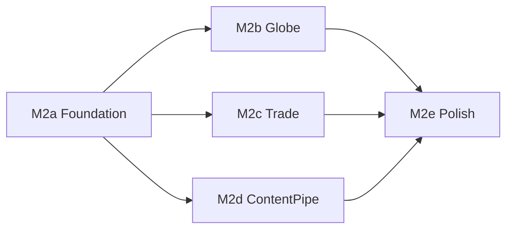

# 《环球航商》iOS Expo — 下一里程碑需求规格

| 字段 | 内容 |
|------|------|
| 文档编号 | REQ-ios-expo-M2 |
| 版本 | v0.2 |
| 产品 | 《环球航商》/ Airborne Trader |
| 目标工程 | [`ios/expo/`](../ios/expo/)（Expo Go SDK 54 · 12 枢纽 Demo） |
| 关联 | [PRD_01.md](../PRD_01.md)；[CONTENT_ASSET_SPEC.md](CONTENT_ASSET_SPEC.md)（CAS-01 · Godot 美术/音乐真源）；[v0.2_REQUIREMENTS.md](v0.2_REQUIREMENTS.md)；[ios/expo/README.md](../ios/expo/README.md)；[ios/github.md](../ios/github.md) |
| 前置里程碑 | **M1（已交付）**：审阅优化 — 真实登机倒计时与自动起飞、行李随票失效、购买校验与加权成本、时钟隔离、AsyncStorage 存档、成就 toast、Reduce motion、safe-area |
| 状态 | M2 已交付；验收对照见 [`docs/superpowers/plans/2026-08-01-ios-expo-m2-acceptance.md`](superpowers/plans/2026-08-01-ios-expo-m2-acceptance.md) |

本文档定义 **iOS Expo Demo 的 M2 里程碑**：在 M1 已可玩、可存档的闭环上，补齐「可感知的地球」、贸易深度、内容管线与可发布质量，使手机版从「设计稿可玩移植」升级为「可持续迭代的移动 Demo」。

与 Godot / CAS 的关系：

- **玩法与内容语义**尽量对齐 [`v0.2_REQUIREMENTS.md`](v0.2_REQUIREMENTS.md)（定价、枢纽、成就口径）；
- **美术气质、命名、版权**对齐 [`CONTENT_ASSET_SPEC.md`](CONTENT_ASSET_SPEC.md)；**Expo 子集、落盘路径与验收以本文件 §9 为准**；
- **表现与工程**独立于 Godot（React Native / Expo）；
- 冲突时：移动端以本文件为准，桌面主线以 PRD / v0.2 / CAS 为准。

---

## 1. 背景与目标

### 1.1 M1 已交付回顾

| 域 | 已交付 | 仍薄弱 |
|----|--------|--------|
| 核心循环 | 买 → 订票 → 倒计时/加速 → 过场 → 落地卖出 | 只能「全部卖掉」；无法部分出售/丢弃 |
| 时间与登机 | `depMin` 真实等待；到点强制起飞；Speed up | 无「距起飞 &lt;2h 灰显 / 默认聚焦下一班」 |
| 行李 | 加购随票；落地重置 23 kg | 落地超重无明确处置文案；cargo 与 carry-on 策略仍粗 |
| 存档 | AsyncStorage 节流读写 | 无多存档槽、无导出/清除确认分级、无版本迁移测试 |
| 地球 | `earth.png` + 可拖转 + 枢纽 pin | 无持票航线弧；无只读城市卡；无松手惯性 |
| 市场情报 | 有 hot/ok/cold 标签（持票 / focus 时） | 无目的地利润排序；无付费快照；无 sparkline |
| 内容 | 手写 `gameData.js` 12 城；[`ios/assets/`](../ios/assets/) 图包已齐 | 未接 ETL；扩城靠手工 `require()`；见 §9 |
| 反馈 | Toast、成就 toast、`expo-haptics`、`optSound` 触感 click | 无真·SFX 文件；出售分级仅 toast 文案 |
| 平台 | Expo Go、safe-area、Reduce motion | 无 EAS / TestFlight；无自动化测试 |

### 1.2 M2 目标一句话

让玩家在真机上 **转地球选城、带着情报做一笔完整买卖、进度可靠保存**，并为后续扩到 20–30 枢纽打通 **内容导出管线**；质量上达到「可发给外部试玩」的标准（崩溃率、存档安全、基础无障碍）。

### 1.3 成功标准（产品层）

1. 地球页可拖转（或等效浏览）并点选枢纽，当前城与目的地有视觉区分；持票时显示本段大圆弧（静态或简易动画均可）。
2. 行李页支持 **按条目出售 / 丢弃**；落地超重有明确提示与处置路径。
3. 市场在持票状态下情报可读性不低于 M1，并新增 **至少一种深度情报**（见 §4）。
4. 存档支持 **版本号迁移** 与「清除存档」二次确认；冷启动恢复后时钟与机票状态一致。
5. 至少 **一条** 从 `etl/`（或现有 `hubs_*.yaml`）到 `ios/expo` 的内容导出路径可重复跑通；新增一座枢纽的手工步骤 ≤ 文档中的 checklist。
6. 提供 EAS 开发构建或 TestFlight 内测包说明；核心回路有不少于 8 条自动化断言（逻辑层，不强制 UI 快照）。

---

## 2. 范围边界

### 2.1 纳入（In Scope）— M2

| # | 能力 | 优先级 | 说明 |
|---|------|--------|------|
| G1 | 可交互地球（旋转 / 惯性 + 枢纽锚点） | P0 | 替换「拖不动的地球」文案与体验 |
| G2 | 持票大圆弧 + 起降点高亮 | P0 | 强化「在飞哪一段」的空间感 |
| T1 | 库存部分出售 / 丢弃 | P0 | 打破「只能 Sell everything」 |
| T2 | 落地超重处置 | P1 | 提示 + 引导去 Bags 或强制打开出售 |
| T3 | 市场深度情报（二选一或都做轻量版） | P1 | 见 §4.2 |
| S1 | 存档版本迁移 + 清除确认 | P0 | 防坏档；防误触 Restart |
| S2 | 逻辑层单测 / 小型测试脚手架 | P0 | 定价、登机等待、存档 round-trip |
| C1 | ETL → Expo 内容导出（12→可扩） | P1 | 与 `tools/export_ios_data.py` 等对齐 |
| C2 | 枢纽扩至 **16–20**（可选冲刺） | P2 | 有管线后再扩；否则维持 12 |
| A1 | 关键操作触感（购票、起飞、成交） | P2 | `expo-haptics`；事件表见 §8 |
| A2 | 最小 SFX 包（5 个逻辑 ID） | P2 | 可选；无音频可用触感验收 G/T/S；清单与工程约定见 **§9** |
| P1 | EAS Build / 内测分发文档 | P1 | 不强制上架 App Store |
| U1 | 航班列表「下一班」默认排序与即将起飞提示 | P1 | 对齐桌面航班 UX 的一小部分 |

### 2.2 明确不纳入（Out of Scope → M3 / 主线 v0.2）

| 项 | 归属 |
|----|------|
| 500+ 城、全球商业机场、中转联程 | Godot v0.2 / 移动 M3+ |
| 真实航司 Logo、实时航班、联网票价 | 永不进 Demo |
| App Store 正式上架、IAP、账号系统 | M3+ |
| 完整 i18n（UI 多语言） | M3；本版 UI 保持英文（与当前 Expo 一致） |
| Lock Screen Widget / Push Banner（设计稿有、无实现） | M3 探索 |
| 将 Expo 与根目录 `expo-go/`（30 城快照）合并为单一工程 | 需单独立项 |
| 修改 Godot `EconomySystem` 核心公式 | 桌面主线；移动端只消费同源语义 |
| 循环 BGM / 完整配乐系统 | M3；M2 明确不做（见 §9.3） |

---

## 3. 地球与空间表现（G1 / G2）

### 3.1 交互地球

**现状：** [`GlobeScreen.js`](../ios/expo/src/components/GlobeScreen.js) 展示静态地球图与横向城市 chip。

**需求：**

1. 玩家可水平拖转地球（最低：贴图 UV 偏移或 `Animated` 旋转容器）；松手可有短惯性。
2. 12（或扩容后）个枢纽在球面上有可点锚点（可用屏幕投影近似，不要求真球面几何引擎）。
3. 点选非当前城：展示只读城市卡（名、IATA、是否 visited、距离当前城 km）；**不能瞬移**；CTA 为「在 Flights 找去程」或「设为关注目的地」（关注仅影响情报排序，见 §4）。
4. 当前城锚点使用既有 teal 语义；未访问城降低透明度（与 chip 一致）。
5. Reduce motion 开启时：关闭惯性，拖转可保留。

**验收：**

- 真机单手可完成「认出当前城 → 拖到另一枢纽 → 点开卡片」&lt; 10 秒。
- 低端机拖转不掉到无法操作；允许降低锚点数量策略（远侧聚合为「···」不强制本版）。

### 3.2 航线弧

1. 持票时在地球上绘制 **当前段** 起降点连线（大圆弧近似或二次贝塞尔即可）。
2. 过场期间可保持弧线或切换到全屏 cutscene（与现逻辑兼容）。
3. 无票时不绘制航线弧，避免噪声。

---

## 4. 贸易深度（T1–T3）

### 4.1 部分出售与丢弃（T1）— P0

**现状：** 仅 `sellAll`。

**需求：**

1. Bags 列表每一行可进入明细：数量步进、**出售选中数量**、**丢弃选中数量**。
2. 出售：按 `priceAt(id, city)` 结算；更新现金、利润统计、成就口径与 M1 一致。
3. 丢弃：无退款；需一次确认（文案强调不可恢复）。
4. 落地自动弹出的出售面板：保留「Sell everything」，并增加「到 Bags 分批处理」入口。

**验收：**

- 可只卖掉栈中 1 件保留其余继续飞。
- 丢弃后重量与列表立即一致；存档后重启仍一致。

### 4.2 落地超重（T2）— P1

落地将 `bagLimit` 重置为默认后，若 `bagUsed > bagLimit`：

1. Toast 或出售面板顶部警告：「Carry-on over by X kg — sell, discard, or buy baggage on your next ticket。」
2. 不自动没收货物。
3. 在超重状态下仍允许打开 Market/Flights，但买票流程若选 cabin 前应再次展示超重提示（非阻断，除非产品决定阻断——**本版不阻断起飞**）。

### 4.3 深度情报（T3）— P1

在 M1 标签基础上，实现下列 **至少一项**：

| 方案 | 描述 | 验收 |
|------|------|------|
| A. 关注目的地 | 地球点选或 Flights 长按「盯住」某城；市场列表按该城涨幅排序并显示对比价 | 盯住后进入 Market，本地货按目的地利润排序 |
| B. 付费快照 | 花固定现金（建议 $150–200）解锁当前城全部在售商品在「已访问目的地」的价差表，持续到下次起飞 | 支付后可见表；现金扣除；存档保留至起飞清除 |
| C. 迷你 sparkline | 对每商品显示 3–5 个哈希稳定的「假历史」点（不宣称真实） | 仅增强可读，不改变 `priceAt` |

推荐默认：**A + 轻量 C**；B 作为可选加分。

---

## 5. 存档与设置（S1）

### 5.1 版本迁移

1. 存档 JSON 增加 `saveVersion`（从 `1` 起）。
2. 启动时按版本链式升级；未知将来版本则提示「存档过新」并提供「开新局 / 放弃读档」。
3. 迁移失败：保留坏档备份键（如 `…-corrupt-<ts>`），开新局，不白屏。

### 5.2 清除与重开

1. Settings「Restart game」改为两步确认（现有一键过轻）。
2. 增加「Clear save & restart」与「Restart keep nothing」语义合并为同一确认流即可。
3. Reduce motion、（若有）触感开关写入存档或 `AsyncStorage` 独立 prefs 键。

### 5.3 验收

- 手改缺字段的旧档仍能启动。
- 杀进程重开：现金、库存、城市、机票、`minsToDep`、成就解锁集合一致（误差：时钟允许 ±1 tick）。

---

## 6. 内容管线（C1 / C2）

### 6.1 导出契约

与现有 Content API（`defineCity` / `defineProduct` / `defineFlight`）对齐，导出物建议：

```text
ios/expo/data/ios-data.json   # 或继续生成 JS 种子
tools/export_ios_data.py      # 已有则扩展；无则本里程碑补齐
```

**字段最低集：** 城 id/坐标/时区/costIndex/demand/note/airline；商品 id/home/base/w/category/icon 键；具名航班可选。

### 6.2 资源注册

Metro 仍要求字面量 `require()`：导出工具需 **生成或校验** [`src/assets.js`](../ios/expo/src/assets.js) 中路径完整性（缺图则回退 `p_generic` 并在 CI 警告）。

### 6.3 扩城（C2，P2）

- 目标区间 **16–20** 枢纽（从桌面 20 枢纽子集选取）。
- 每城至少：头图、2+ 本地商品、note、airline。
- 无完整美术时允许 generic 占位，但须在数据来源页声明。

---

## 7. 航班列表微调（U1）

1. 默认排序保持 Departure；列表顶部标注「Next」在第一张「尚未起飞」的卡片（相对当前本地时间）。
2. 若 `depMin` 相对本地已过且未购票，卡片灰显或移到「Tomorrow」分组（二选一，实现选简单者）。
3. 不引入中转。

---

## 8. 反馈与打磨（A1，P2）

事件与触感 / 可选 SFX 的对应关系如下；**SFX 文件、目录、接线与验收以 §9 为准**。

| 事件 | 触感（`optHaptics`） | SFX 逻辑 ID（`optSound`，可选） |
|------|----------------------|----------------------------------|
| 购票成功 | notification success 或 light impact | `sfx_ticket` |
| 开始过场 / Speed up 起飞 | medium / light impact（click） | `sfx_gate` |
| 出售盈利 | notification success | `sfx_profit` |
| 出售亏损 | notification warning | `sfx_loss` |
| 成就解锁 | notification success | `sfx_ach`（可复用 profit 音色） |

Reduce motion 开启时：触感可保留；真·SFX 跟随系统静音 / 铃声开关（见 §9.4）。

---

## 9. 媒体与素材需求（美术 · 音乐）

本节定义 **iOS Expo Demo** 的美术与音频交付口径。气质、禁止风格、版权总则对齐 [CONTENT_ASSET_SPEC.md](CONTENT_ASSET_SPEC.md)（CAS-01）；**本文件列出 Expo 子集、仓库落点与 M2 验收**。CAS 管 Godot 全量；路径冲突时以本节 Expo 路径为准。

### 9.1 范围与原则

1. **气质：**「可旋转的真实世界航线图鉴」——清晰、可信、略带旅途温度（CAS §0.1–0.2）。
2. **UI 语言：** Expo Demo 界面保持英文；资源文件名与逻辑 ID 使用 ASCII。
3. **美术真源目录：** [`ios/assets/`](../ios/assets/)，经 Metro [`ios/expo/src/assets.js`](../ios/expo/src/assets.js) 字面量 `require()` 注册。
4. **音频真源（Godot）：** [`game/assets/audio/`](../game/assets/audio/)；**Expo 仓内当前无** `ios/assets/audio/`。M2 的 G/T/S 验收**不依赖**真音频文件。
5. **禁止：** 未授权航司 Logo、违禁品包装图、CAS §0.4 所列风格套路。

### 9.2 美术素材清单（现状盘点 · 2026-08）

| 类 | 命名约定 | 规格 | Expo 现状 | M2 |
|----|----------|------|-----------|-----|
| 地球贴图 | `earth.png` | 等距柱状；建议 ≥2048×1024 | 已有 | **必有**（已交付） |
| 城头图 | `city_{id}.webp` | 横构图 WebP；每枢纽 1 | 12 城已齐（istanbul…tokyo） | 扩城时每城必交 |
| 商品图 | `p_{hub}_{sku}.webp`、`p_cat_*.webp`、`p_generic.webp` | 方图；缺图回退 generic | 特色/品类/generic 已齐 | 新商品必交图或声明使用 generic |
| 成就图标 | `ach_*.webp` | 与 `ACHIEVEMENTS[].icon` 一一对应 | 已齐 | 新成就必交 |
| UI 图标 | `ic_*.webp` | 约 24–32px 语义图标 | 已齐 | 仅新控件时补 |
| 过场帧 | `anim_flight_{takeoff,cruise,land}.webp` | 全屏可读；三段语义可辨 | 已齐 | **必有**（已交付） |
| 品牌 | `logo_mark.webp`、`app_icon.webp`、`splash.webp`；Expo 壳 [`ios/expo/assets/`](../ios/expo/assets/)（`icon.png` 等） | App 图标 / 启动 | 已齐 | **必有**（已交付） |
| 航线弧 / pin | 程序绘制（非贴图） | 当前 / 已访 / 未访色区分 | pin 已有；**弧未做** | 弧为功能（G2），非新美术文件 |

**扩城（C2）附加美术：** 新枢纽至少 **头图 + ≥2 本地商品图 + note**；无完整美术时允许 `p_generic` / 占位头图，须在数据来源（Sources）页声明。

**Metro 约束：** 新增光栅必须同时登记进 `assets.js`；导出/校验工具缺图时回退 `p_generic` 并在 CI 警告（见 §6.2）。

### 9.3 音乐与音效清单

分三层，避免「可选」含糊：

#### 9.3.1 M2 默认可验收路径（无音频文件）

| 开关 | 行为 |
|------|------|
| `optSound === true` | 购票成功 / 卖出 / 起飞开始时额外 `Haptics.impactAsync(Light)`（click） |
| `optHaptics === true` | Toast 类反馈使用 success / warning 通知触感 |
| 两开关独立 | Sound 开、Haptics 关时仍可有 click；反之亦然 |

无 `ios/assets/audio/` 时**不得因缺文件崩溃**；Settings 文案可写明「Sound clicks · no audio files」。

#### 9.3.2 M2 可选完整 SFX 包（A2 · P2）— 最小 5 条

交付时从 Godot 包拷贝或转码到 Expo 目录（见 §9.4）。逻辑 ID 与触发时机固定如下：

| Expo 逻辑 ID | 触发时机 | Expo 文件 | 源 Godot 文件 |
|--------------|----------|-----------|----------------|
| `sfx_ticket` | 购票成功 | `sfx_ticket.m4a` | `audio_sfx_ticket_ok.ogg` |
| `sfx_gate` | 开始过场 / Speed up | `sfx_gate.m4a` | `audio_sfx_ff_confirm.ogg` |
| `sfx_profit` | 出售净值 ≥ 0 | `sfx_profit.m4a` | `audio_sfx_sell.ogg` |
| `sfx_loss` | 出售净值 &lt; 0 | `sfx_loss.m4a` | `audio_sfx_loss.ogg` |
| `sfx_ach` | 成就解锁 toast | `sfx_ach.m4a` | `audio_sfx_arrive.ogg` |

Godot 侧另有更全的 P0 SFX（见 CAS §2.3 / `AUDIO_MANIFEST.csv`）；**Expo M2 不强制导入全表**，以上 5 条为移动端最小集。

#### 9.3.3 BGM（M2 明确不做 · 预留 M3）

- **不引入**循环配乐；不要求 `expo-av` 播放 BGM。
- 若 M3 需要，映射 CAS：`bgm_globe_day` / `bgm_market` / `bgm_menu` / `bgm_night`，建议落盘 `ios/assets/audio/bgm/`。

### 9.4 工程与目录约定

```text
ios/assets/audio/sfx/           # 镜像副本（文档/管线）
ios/expo/assets/audio/sfx/      # Metro 打包真源：sfx_{ticket,gate,profit,loss,ach}.m4a
ios/expo/src/assets.js          # 图片 require 表（必维）
ios/expo/src/audio.js           # load + play(logicId)；尊重 optSound / 系统静音
```

| 约定 | 要求 |
|------|------|
| 依赖 | `expo-av`；**播放失败时**回退 §9.3.1 触感，禁止抛未捕获异常 |
| Metro | 使用 **AAC `.m4a`**（Metro / iOS AVPlayer 均支持；**勿用 `.ogg`**） |
| Settings | Sound 开 = 真 SFX 或 click 触感 fallback；与 Haptics 开关独立 |
| Reduce motion | 不强制关闭 SFX；SFX 跟随系统静音 |
| 格式 | AAC `.m4a`，单文件建议 &lt; 100 KB；可由 Godot `.ogg` 用 ffmpeg 转码 |

### 9.5 版权与署名

- 复用 Godot 音频包：许可与 [`game/assets/audio/AUDIO_MANIFEST.csv`](../game/assets/audio/AUDIO_MANIFEST.csv) 及 CAS §2.6 一致。
- 城头图 / 商品图：非品牌包装照；禁止项同 CAS。
- Sources（数据来源）页在交付 A2 音频后增加一行说明（如 procedural / listed licenses）；纯触感阶段可不增加。

### 9.6 媒体验收清单

- [ ] §9.2 表中标注「必有」的类别在 `ios/assets/` 存在，且 `assets.js` 可解析，无坏链。
- [ ] 缺商品图时 UI 回退 `p_generic`，不白屏、不红屏。
- [ ] 无音频目录/文件时：`optSound` 开仍有 click 触感；冷启动与购票/卖出路径无因缺音频导致的崩溃。
- [ ] 若交付 A2 音频包：5 个逻辑 ID 均可播；`optSound` 关则静音；Sources 或 README 有一句来源说明。
- [ ] 新增枢纽/商品的美术步骤可对照 §9.2 扩城行 + §6.3 checklist 执行。

---

## 10. 工程、测试与分发（S2 / P1）

### 10.1 测试（P0）

在 `tests/` 或 `ios/expo/__tests__/` 增加 **不依赖 Expo 运行时** 的逻辑测试，至少覆盖：

1. `priceAt` / `factorFor` 家乡折价与异地溢价方向正确；
2. 登机等待：`depMin` 跨日取模；
3. 行李：加购只在持票期生效，落地回到默认；
4. 库存合并加权平均成本；
5. 存档 serialize → migrate → deserialize round-trip；
6. `routesFrom` 在 `replace: true` 时去掉生成腿；
7. 成就阈值在临界值恰好解锁；
8. `sellData` 净值符号与金额。

### 10.2 分发（P1）

文档化：

```bash
cd ios/expo
npx eas build --profile preview   # 或 development
```

说明：Expo Go 与 Dev Client 差异、SDK 54 版本钉扎、试玩账号无需登录。

### 10.3 性能预算

- 时钟隔离在 M1 已做；M2 地球拖转时 Market 未挂载则不应被拖转拖垮（Globe 独立重绘）。
- 目标：中端 iPhone 上拖转 ≥ 30 FPS（可接受掉帧，不可卡死）。

---

## 11. 里程碑切片与依赖



| 切片 | 内容 | 预估 |
|------|------|------|
| **M2a** | 存档迁移、Restart 确认、逻辑单测脚手架 | 小 |
| **M2b** | 交互地球 + 航线弧 | 中 |
| **M2c** | 部分出售/丢弃、超重提示、深度情报 A | 中 |
| **M2d** | ETL 导出 + assets 校验；可选扩到 16 城 | 中 |
| **M2e** | 航班 Next 提示、触感/SFX（§9）、EAS 文档 | 小 |

建议实现顺序：**M2a → M2c → M2b → M2d → M2e**（先保证贸易与存档正确，再做地球表现与扩内容）。

---

## 12. 验收清单（发布试玩前）

- [ ] 新用户：Intro → 买本地货 → 订票 → 等待或 Speed up → 落地 → 部分出售 → 再起飞
- [ ] 杀进程恢复持票倒计时，到点仍自动起飞
- [ ] 落地超重有提示且货物未丢
- [ ] 地球可拖、可点城、持票可见弧
- [ ] Restart 需确认；清档后回到伊斯坦布尔与起始现金
- [ ] 单测全部通过；`export_ios_data`（或等价）可重复执行
- [ ] 内测包或 Expo Go 扫码说明可交给非开发同学
- [ ] 媒体：§9.6 清单通过（无音频亦可；有 A2 则 5 条 SFX 可播）

---

## 13. 开放问题 — 产品决策（已关闭 · 2026-08-01）

| # | 问题 | 决策 | 归属 |
|---|------|------|------|
| 1 | 情报方案 A / B / A+C | **A 关注目的地 + 轻量 C sparkline** | B 付费快照 → M3 P2 |
| 2 | 扩城是否冲 16–20 | **管线就绪即可**，维持 12 枢纽 | C2 扩城 → M3 |
| 3 | UI 语言 | **保持英文** | 中英切换 → M3 |
| 4 | 与 `expo-go/` 双轨 | **M2 维持双轨** | **已决议**：统一到 `ios/expo/` 单一工程，`expo-go/` 从未存在（见 [2026-08-02-dualtrack-merger-resolution.md](superpowers/plans/2026-08-02-dualtrack-merger-resolution.md)） |
| 5 | 超重起飞是否阻断 | **不阻断**（仅提示） | 与 §4.2 一致 |
| 6 | A2 音频是否必须 | **必须带真·SFX**（5 条 AAC） | 已入库；§9.3.2 |

验收对照表：[`docs/superpowers/plans/2026-08-01-ios-expo-m2-acceptance.md`](superpowers/plans/2026-08-01-ios-expo-m2-acceptance.md)。

---

## 14. 修订记录

| 日期 | 版本 | 说明 |
|------|------|------|
| 2026-08-01 | v0.1 | 基于 ios/expo M1 审阅优化完成后的下一步需求初稿 |
| 2026-08-01 | v0.2 | 新增 §9 媒体与素材（美术·音乐）；修正 §1.1 过时现状；A2/BGM 范围消歧；关联 CAS-01 |
| 2026-08-01 | v0.3 | 关闭 §13 六个开放问题；状态改为已交付；挂验收对照表 |
