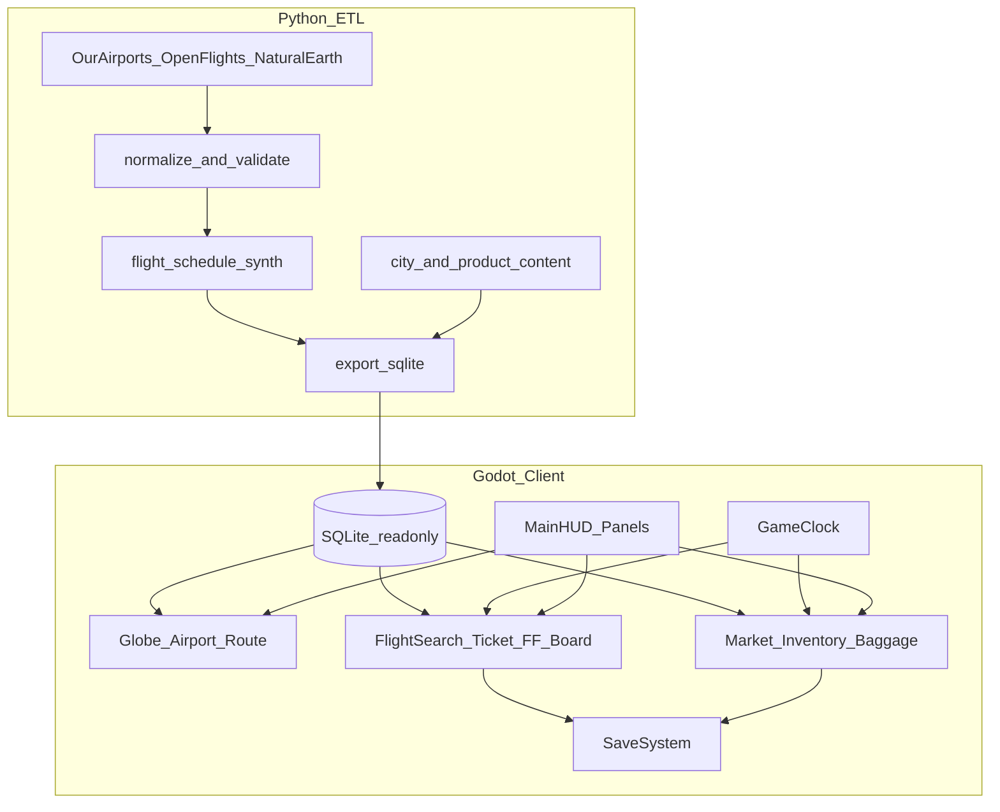
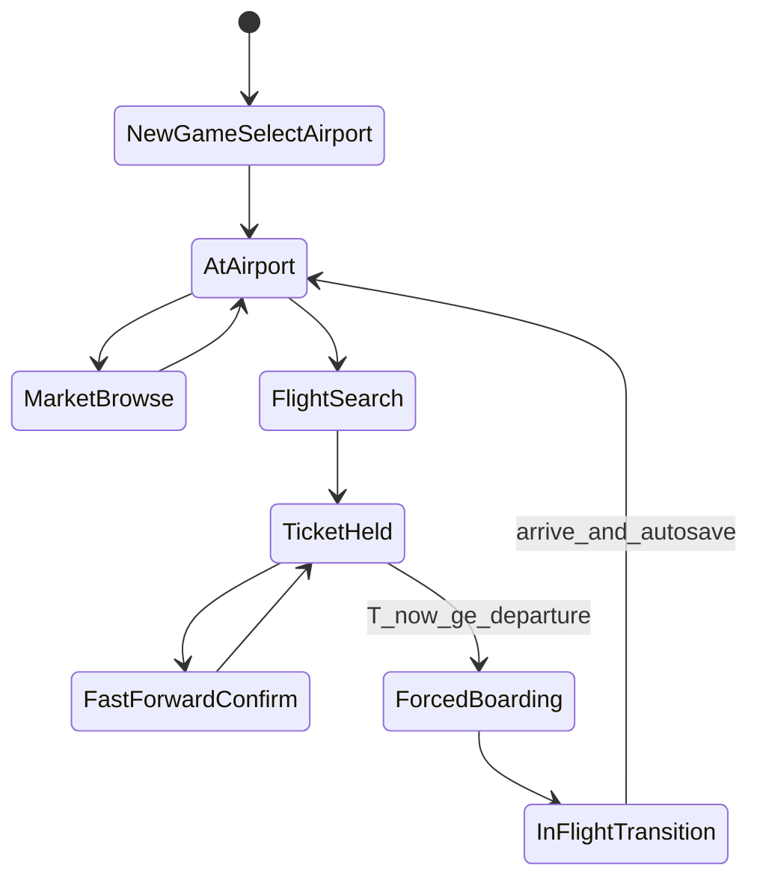

# 《环球航商》Demo 完整版实现计划

> **For agentic workers:** 实现时按阶段顺序推进；每阶段结束必须满足该阶段退出条件后再进入下一阶段。推荐使用 subagent-driven-development 或 executing-plans 按任务执行。

**Goal:** 交付满足 PRD §27 共 22 条验收标准的离线单机 Demo——玩家可在 20 座枢纽机场间完成「读城市 → 买商品 → 检索/购票 → 加速跳跃 → 强制登机 → 5 秒过场 → 异地销售 → 存档」闭环。

**Architecture:** Python ETL 离线生成拟真世界快照（机场/航线/航班/城市/商品/价格/署名）写入 SQLite；Godot 4.x 客户端只读数据库、驱动 3D 地球与全部游戏系统。运行时不做原始 CSV 清洗。

**Tech Stack:** Godot 4.4.x（项目启动后锁定小版本，开发期不升级）、GDScript、SQLite（Godot 用 `SQLite` 插件或内置 GDExtension，选定后写死）、Python 3.11+（pandas / shapely 可选）、Natural Earth（海岸线贴图或简化 mesh）、OurAirports + OpenFlights 开放数据（拟真时刻表，界面强制标注重建来源）。

---

## 0. 范围与锁定决策（不再讨论）


| 决策项  | Demo 取值                                                                                        |
| ---- | ---------------------------------------------------------------------------------------------- |
| 范围   | PRD §24 Demo：仅 ATL/DXB/DFW/DEN/LHR/ORD/IST/LAX/HND/PVG/CDG/AMS/CAN/FRA/PEK/SIN/ICN/HKG/BKK/MIA |
| 模式   | 仅沙盒（无限旅行）。30 日挑战延后，不进入本 Demo                                                                   |
| 航班数据 | 方案 A：OpenFlights 直飞关系 + 拟真时刻表生成器（2025-03 覆盖）                                                   |
| 中转   | 仅直飞                                                                                            |
| 航空公司 | 文字名称/代码，无 Logo                                                                                 |
| 城市图片 | 无                                                                                              |
| 多语言  | 仅简体中文 UI                                                                                       |
| 初始条件 | 资金等值 USD$50,000（内部以 USD 结算，UI 同时显示当地币与 USD 折算）；随身 5kg；经济舱托运 20kg                               |
| 时间流速 | **360×**：`1s 现实 = 6min 游戏` ⇒ `1 游戏日 = 4 现实分钟`（修正 §24.3「60倍」笔误，与 §7.2 / §4.1 对齐）                |
| 基准时间 | `2025-03-01 00:00:00 UTC`                                                                      |
| 公务舱  | `P_business = P_economy × 10`；行李额度 60kg                                                        |
| 行李扩展 | +10kg / ¥500；+20kg / ¥900；+50kg / ¥2,000（行程结束恢复）                                               |
| 货运   | 50kg 起档；单价约为同重量行李扩展的 60%；独立于个人行李                                                               |
| 过场   | 固定 5 秒；时间在动画开始时 `+= duration_minutes`                                                          |
| 退票   | 起飞前可退，手续费 30%；强制登机后不退                                                                          |
| 平台   | Windows + macOS 桌面优先                                                                           |


**明确不做（§24.4）：** 20 座以外机场、真实时刻表、Logo、联网、联程、动态汇率、成就、海关、真实飞行模拟。

---

## 1. 系统架构




**核心循环状态机：**




---

## 2. 仓库目录结构（从空仓新建）

```text
flyyy/
  PRD_01.md
  README.md
  docs/superpowers/specs/2026-07-25-demo-design.md   # 设计纪要（实现前写入）
  docs/superpowers/plans/2026-07-26-demo-implementation.md
  etl/
    requirements.txt
    README.md
    config/hubs_20.yaml                 # 20 IATA + 城市映射
    scripts/
      01_fetch_sources.py
      02_normalize_airports.py
      03_build_routes.py
      04_synth_flights.py
      05_build_cities_products.py
      06_build_markets_fx.py
      07_validate_and_export.py
    content/cities/*.md.json            # 人工编辑城市简介
    content/products/*.yaml             # 每城 ≥5 商品
    out/                                # 生成物（可 git-lfs 或构建产物）
  game/                                 # Godot 项目根
    project.godot
    addons/                             # SQLite 插件
    assets/earth/                       # 地球贴图 / 简单 shader
    data/                               # 打包进游戏的 sqlite
    scenes/
      main.tscn
      globe/globe.tscn
      ui/*.tscn
      transition/flight_transition.tscn
    scripts/
      autoload/
        AppState.gd
        GameClock.gd
        DataService.gd
        SaveSystem.gd
        EventBus.gd
      systems/
        FlightScheduler.gd
        FlightSearch.gd
        TicketService.gd
        FastForwardSystem.gd
        FlightTransitionSystem.gd
        MarketSystem.gd
        EconomySystem.gd
        InventorySystem.gd
        BaggageService.gd
        TravelLog.gd
      render/
        GlobeController.gd
        AirportRenderer.gd
        RouteRenderer.gd
      ui/
        MainHUD.gd
        AirportCard.gd
        FlightSearchPanel.gd
        TicketPurchaseCard.gd
        CityPanel.gd
        MarketPanel.gd
        InventoryPanel.gd
        TravelLogPanel.gd
        AttributionPanel.gd
        NewGamePanel.gd
  tests/
    etl/                                # pytest
    game/                               # 关键 GDScript 逻辑单测（必要时 GUT）
```

---

## 3. 数据层设计

### 3.1 数据库文件（Demo 收敛为 2 个，语义对齐 PRD §20.3）

- `world.sqlite`：countries / cities / airports / airport_city / airlines / routes / products / market_base / fx_rates / attributions / meta
- `flights_2025_03.sqlite`：`flight_instance`（按 origin + departure 索引）

`meta` 表必含：抓取日、基准日 `2025-03-01`、来源名/版本/许可证、ETL 版本、数据哈希、已知缺失。

### 3.2 航班合成规则（可测、可复现）

1. 从 OpenFlights 过滤「两端均在 20 座」的航线；不足时用距离/枢纽等级补齐，保证**每座机场 ≥8 个直飞目的地**（§28 风险五）。
2. 距离：球面大圆距离（km）。
3. 飞行时长：`duration_min = cruise_factor × distance + taxi_pad`（带上下限校验）。
4. 每日班次：按航线权重生成 2–8 班/日，覆盖 2025-03-01～03-31（沙盒可循环或复制到更长窗口；Demo 至少覆盖开局后 30 游戏日可购航班）。
5. 航班号：`{airline_iata}{100-999}` 确定性生成（seed = route + day + slot）。
6. 票价：按 §12 公式算经济舱；公务舱 ×10；全航班 `cabin_business_available=true`。
7. UI 全局角标/购票页固定文案：*「航班网络基于公开航空数据重建，不代表真实购票信息。」*

### 3.3 城市与商品内容

- 20 城人工撰写：卡片 80–150 字；完整页分概览/历史/地理/产业/饮食/旅行提示（§13.3）。
- 每城 ≥5 种合法消费品（禁酒烟药武等，§14.1）；字段齐备 `weight_kg / shelf_life_hours / rarity / origin_*`。
- 价格：ETL 预计算各城 `buy_base` / `sell_base`（产地低、远端稀缺高），运行时乘以确定性日波动：
`Seed = SaveID + CityID + GameDate`（§17.2）。
- 汇率：冻结 ≤2025-03-01 快照；存档内不变。

### 3.4 ETL 校验（§22）必须失败即阻断导出

机场：合法经纬、无零坐标误、IATA 唯一、时区存在、有服务城市。  
航班：起降不同、到达晚于起飞、时长合理、距离匹配、运营日覆盖。  
价格：>0、单位一致、无「零飞行必赚」边（同城买卖价差 + 邻近城套利上限抽检）。

---

## 4. Godot 客户端模块职责


| 模块                                   | 职责                                                 |
| ------------------------------------ | -------------------------------------------------- |
| `DataService`                        | 打开只读 SQLite；机场/航班/城市/商品查询 API；缓存 20 机场             |
| `GameClock`                          | UTC 主时钟；360×；失焦/设置/存档 UI 暂停；其余界面不暂停                |
| `AppState`                           | 资金、当前位置、已访问、持有机票、库存、货运、SaveID                      |
| `GlobeController`                    | 半径 `EarthRadius=10`；拖转/滚轮缩放/点击选中/双击聚焦              |
| `AirportRenderer`                    | 20 点 MultiMesh 或 MeshInstance；标签屏幕空间 UI            |
| `RouteRenderer`                      | slerp 大圆弧；默认只画选中机场可达线 + 当前行程                       |
| `FlightSearch`                       | 当前机场、`departure > now`、关键词+多条件筛选+排序                |
| `TicketService`                      | 购票扣款、舱位、行李扩展、货运、退票 30%                             |
| `FastForwardSystem`                  | 二次确认；跳到最近已购起飞时刻；刷新市场；保质期按跨度结算                      |
| `FlightTransitionSystem`             | 强制登机 → 加飞行时长 → 5s 过场 → 到达结算                        |
| `MarketSystem` / `EconomySystem`     | 买卖、日价、需求打压/恢复、品质系数                                 |
| `InventorySystem` / `BaggageService` | 重量、扩展、货运独立舱、超重引导加购                                 |
| `TravelLog`                          | §19 旅程记录与收集统计                                      |
| `SaveSystem`                         | JSON 或独立 `save_*.json`：时间/位置/资金/库存/机票/旅行记录；自动保存于到达 |
| `DataAttributionSystem`              | 游戏内数据来源与许可证页                                       |


---

## 5. UI 信息架构（对齐 §18）

- **主 HUD：** 中央地球；左上日期/UTC/当地时；右上资金/行李/当前机场；左搜索；右机场卡；底栏：城市 / 市场 / 航班 / 库存 / 旅行记录；中上：下一班倒计时 +「加速至起飞」。
- **新游戏：** 搜索（名/IATA/ICAO/城市）+ 地球点选 +「随机机场」（仅 20 座有航班机场）。
- **航班面板：** 行内经济/公务价；展开购票卡（舱位、行李对比、扩展、货运、总价明细）。
- **城市面板：** 标签：概览 / 历史文化 / 饮食特产 / 市场 / 航空连接 / 访问记录 / 数据来源。
- **强制登机：** 全屏不可取消提示 → 进入过场。

视觉：桌面模拟器优先清晰可读；地球用贴图+简单昼夜可选；过场用简短 2D/3D 序列即可，不追求影视级。

---

## 6. 分阶段交付（映射 PRD §26 + §27）

### 阶段一：数据与地图原型

**交付：** ETL 导出 20 机场；Godot 读库；球形地球；点位；搜索/随机起点；任意两机场大圆航线；SQLite 冒烟。

**退出条件：** 可选中任一座并画到另一座；方向正确；加载无卡顿。

**验收映射：** §27.1–2（部分）、地球交互。

### 阶段二：航班与时间原型

**交付：** `GameClock`；时区显示；航班合成入库；全局检索；无限提前购票；经济/公务；加速跳跃；强制登机；5s 过场+时间跳过；到达换站。

**退出条件：** 可买任意未来航班；公务价×10；加速落地时刻正确；强制登机触发；过场后位置与时间正确。

**验收映射：** §27.3–13。

### 阶段三：贸易闭环

**交付：** 商品与市场基价；买卖；库存重量；行李扩展与货运；利润统计；防刷需求衰减。

**退出条件：** 20 城可贸易；无明显无限套利；价差可解释；扩展/货运可用。

**验收映射：** §27.14–17。

### 阶段四：内容与体验

**交付：** 20 城完整简介；每城 ≥5 商品文案；弱引导教程（首次购票/首次买卖提示）；UI 收束；数据来源页；存档读档；性能抽检。

**退出条件：** 无外部说明可完成一次完整贸易循环；§27 全表打勾。

**验收映射：** §27.18–22。

---

## 7. 关键公式落地（实现时写死常量）

**时钟：** `game_minutes += delta_seconds * 6`（未暂停时）。

**票价（经济舱）：**  
`P = (C_route + DistanceKM * C_km + fee_o + fee_d) * AirlineFactor * DemandFactor * RandomFactor`  
常量放入 `etl/config/economy.yaml`，导出时物化到每条 `flight_instance`。

**采购/销售：** 按 §15.3–15.4；品质档位按 §16.2。

**加速跳跃：** 保质期按跳过的小时数衰减；市场按新 `GameDate` 重算日价（同日同 seed 稳定）。

---

## 8. 测试与验收策略


| 层          | 内容                                                       |
| ---------- | -------------------------------------------------------- |
| ETL pytest | 20 IATA 齐全；每机场出度 ≥8；航班时间合法性；价 >0；种子可复现                   |
| 时钟单测       | 360×；暂停边界；时区显示样例（PVG/LHR/JFK 等价机场）                       |
| 购票单测       | 公务×10；退票 30%；扩展容量叠加公务基础                                  |
| 经济单测       | 同 seed 同价；连续出售压价；品质折价                                    |
| 手工剧本       | 新档 → 随机机场 → 买特产 → 检索最远航线 → 购公务+行李 → 加速 → 登机过场 → 出售 → 存读档 |
| 性能         | 1080p 地球 60FPS 目标；航班搜索 <500ms（20 机场极易满足）                 |


每阶段结束跑「阶段退出条件检查表」；最终对照 §27 的 22 条出具 Demo 验收清单（markdown checklist）。

---

## 9. 风险与缓解（执行时遵守）

1. **时刻表不真实：** UI 强制重建声明；不宣传可现实购票。
2. **20 点航网过稀：** ETL 强制出度；必要时手工 whitelist 补边。
3. **套利破坏平衡：** 买卖价差 + 机票摩擦 + 需求衰减 + 保质期；阶段三专测。
4. **内容工作量：** 城市/商品用结构化 JSON/YAML 模板批量填，阶段四集中验收字数与禁售类。
5. **SQLite 插件选型：** 阶段一第一天锁定一个 Godot 4.4 兼容插件并写入 README，避免中途换库。

---

## 10. 实现顺序总览（任务包）

1. 初始化 Git + Godot 工程 + ETL 骨架 + `hubs_20.yaml`
2. 阶段一：ETL 机场导出 → 地球/点位/搜索/航线
3. 阶段二：时钟 → 航班生成 → 检索/购票/加速/登机/过场
4. 阶段三：商品市场 → 库存行李货运 → 反套利
5. 阶段四：20 城内容填满 → 教程提示 → 来源页 → 存档 → §27 全验收
6. README：如何跑 ETL、如何用 Godot 打开、数据许可证摘要

**成功标准（一句话）：** 玩家在无外部说明下，因下一城商品/价格/航班机会而主动规划下一段旅程（PRD §30）。