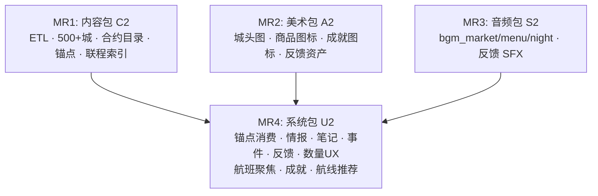

# v0.2 实现计划：按交付包分 MR

> **关联需求：** [`docs/v0.2_REQUIREMENTS.md`](../../v0.2_REQUIREMENTS.md)  
> **分 MR 策略：** 每个 MR 是一个独立可合并的交付包，MR 之间按依赖顺序排列。  
> **架构基线：** Godot 4.7.1（GDScript），Python 3 + pytest（ETL/测试），SQLite（校验产物），JSON（运行时数据）。

---

## MR 依赖图



- **C2 先行**：U2 需要 `product_market_tags`、合约数据、联程索引。  
- **A2 / AU 可并行**：纯资产入仓，不阻塞 C2；U2 引用资产 ID 但开发期可占位。  
- **U2 收口**：消费所有前置包的产物，形成完整 v0.2 可玩包。

---

## MR1: 内容包 C2

**目标：** 从 20 城扩展到 500+ 重点城市数据，引入合约目录、价格锚点、联程索引，产出 `game/data/world.json` + `flights.json` 新版本。

### 阶段 1.1 — 城市列表与配置

**现状：** `etl/config/hubs_20.yaml` 定义 20 枢纽。  
**目标：** 新增 500+ 城市配置源，扩展 ETL pipeline 支持多源合并。

**步骤：**

1. 在 `etl/config/` 新建 `cities_500.yaml`（或分区域文件），每城至少含 `city_id`, `name_zh`, `name_en`, `country_id`, `timezone`, `airport_iata`, `image_asset_id`（可先占位）。源优先级遵循 §2.1.2 遴选规则。

2. 修改 `etl/scripts/05_build_cities_products.py`：
   - 支持读取 `cities_500.yaml` 合并到原 `hubs_20.yaml`。
   - 城市内容字段沿用现有 schema（对齐 §2.3），新字段 `image_asset_id` 加入 JSON 输出。
   - 未提供完整七字段文案的城市标 `content_confidence: "C"`，并输出到 `coverage_report`。

3. 修改 `etl/scripts/02_normalize_airports.py`：
   - 标记 `has_passenger_service: bool` 字段（基于 OpenFlights 航线数据库判断该机场是否有任何 arrival/departure 记录）。
   - L0（全部可查看）由机场全量坐标控制；L1（可旅行） = `has_passenger_service == true`。

4. 修改 `etl/config/economy.yaml`，确认 `starting_cash_usd: 50000.0` 已生效（当前已是此值）。

**验收：** 运行 `python etl/scripts/run_pipeline.py`，`world.json` 中 `cities` 数组 ≥500，`airports` 含 `has_passenger_service`。

---

### 阶段 1.2 — 合约目录（商品升级）

**现状：** 每城 5-15 种轻量特产，`weight_kg` 大多 < 10。  
**目标：** 合约级 weight_kg 10–50，基准价分类匹配 $50k 起始资金，禁 `纪念品` 类别。

**步骤：**

1. 修改 `etl/scripts/05_build_cities_products.py`：
   - `PRODUCT_TEMPLATES` 扩展：增加 `机械` / `能源` / `电子` / `矿产` 模板；`weight_kg` 提升到 10–50 范围；`base_reference_price` 提升到数百-数千 USD。
   - 移除 `纪念品` 类别模板（确保 `product.category != "纪念品"`）。

2. 实现商品继承链：
   ```python
   # CityProduct overrides → RegionDefault → CountryDefault
   def resolve_product(city_id, product_id):
       if product_id in city_products:
           return city_products[product_id]
       if product_id in region_defaults[city_region[city_id]]:
           return region_defaults[city_region[city_id]][product_id]
       return country_defaults[city_country[city_id]][product_id]
   ```
   继承商品写回 `world.json` 的 `products` 和 `markets`，并附加字段 `inherited_from: "region|country"`。

3. 修改 `etl/scripts/07_validate_and_export.py`：
   - 新增门控：每个 L2 城市至少有 3 条商品（含继承）。
   - 生成 `coverage_report.json`：城市数、L1 机场数、缺文案列表、缺商品列表。

4. 新增测试 `tests/etl/test_v2_contract_catalog.py`：
   ```python
   def test_no_souvenir_category():
       """world.json products must not have category '纪念品'"""
       for p in world["products"]:
           assert p["category"] != "纪念品"

   def test_contract_weight_ranges():
       """Majority of products should have weight_kg >= 10"""
       heavy_count = sum(1 for p in world["products"] if p["weight_kg"] >= 10)
       assert heavy_count / len(world["products"]) >= 0.6

   def test_starting_cash_50k():
       assert world["economy"]["starting_cash_usd"] == 50000.0

   def test_inheritance_coverage():
       """All L2 cities have >= 3 products via inheritance"""
       for city in world["cities"]:
           count = count_products_for_city(city["city_id"], world)
           assert count >= 3, f"{city['city_id']} has only {count} products"

   def test_coverage_report():
       with open("etl/out/coverage_report.json") as f:
           report = json.load(f)
       assert report["l2_cities"] >= 500
       assert report["missing_content"] == [] or "allowlist" in report
   ```

**验收：** `pytest tests/etl/test_v2_contract_catalog.py` 通过。

---

### 阶段 1.3 — 价格锚点 product_market_tags

**现状：** `product_market_tags` 字段在 `world.json` 中为空 `{}`。  
**目标：** ETL 计算 `sell_buy_ratio` 并写入 hot/normal/cold 分类。

**步骤：**

实施 `docs/superpowers/plans/2026-07-26-trade-feedback-and-anchors.md` 的 Task 1 全部步骤。具体关键代码变更点：

1. **测试先行**：`tests/etl/test_trade_contracts.py` 中已有 `test_sell_buy_ratio_tags_exist` / `test_sell_buy_ratio_hot_threshold` / `test_sell_buy_ratio_cold_threshold` / `test_sell_buy_ratio_no_city_duplicates` 四个函数。确认它们在 C2 数据生成后运行（原测试针对 20 城；扩展后应仍适用）。

2. 在 `etl/scripts/run_pipeline.py` 价格物化阶段（`06_build_markets_fx.py` 的 `apply_market_model` 函数附近），添加：
   ```python
   product_market_tags = {}
   # In the per-city-product loop:
   buy_origin = markets[origin_city]["products"][product_id]["buy_base_usd"]
   sell_remote = markets[dest_city]["products"][product_id]["sell_base_usd"]
   ratio = sell_remote / buy_origin if buy_origin > 0 else 1.0

   if ratio >= 1.15:
       tag = "hot"
   elif ratio >= 1.0:
       tag = "normal"
   else:
       tag = "cold"

   key = f"{origin_city}|{product_id}"
   product_market_tags.setdefault(key, {"hot": [], "normal": [], "cold": []})
   product_market_tags[key][tag].append(dest_city)
   ```

3. 将 `product_market_tags` 写入 `world.json` 顶层 key。

4. 扩展测试验证：
   - `test_sell_buy_ratio_no_city_duplicates` 中 `all_cities` 应来自 `world["hubs"]` 或 `world["cities"]`（取决于数据 key 名称——确认当前使用 `hubs` 还是 `cities`）。如果是 500+ 城，确认互斥与并集仍完整。

**验收：** `pytest tests/etl/test_trade_contracts.py -v` 通过；`world.json` 中 `product_market_tags` 覆盖所有 origin|product 对。

---

### 阶段 1.4 — 联程索引

**目标：** ETL 生成直飞可达的单中转边，供运行时拼装联程航班。

**步骤：**

1. 在 `etl/scripts/04_synth_flights.py`（或新的 `etl/scripts/04b_build_transfers.py`）添加：

   ```python
   # Build transfer_edges: for each pair (origin, dest) without a direct route,
   # find single-hop hubs (origin → hub → dest) where MCT >= 90 min.
   transfer_edges = {}  # key: "origin_iata|dest_iata" → [{hub, total_distance, direct_duration}]

   for origin in l1_airports:
       for dest in l1_airports:
           if origin == dest: continue
           if has_direct_route(origin, dest): continue
           edges = []
           for hub in potential_hubs(origin):
               if hub == origin or hub == dest: continue
               if not has_direct_route(origin, hub): continue
               if not has_direct_route(hub, dest): continue
               # MCT constraint will be enforced at runtime
               edges.append({
                   "hub": hub,
                   "total_distance_km": route_distances[origin][hub] + route_distances[hub][dest],
                   "seg1_duration_avg": avg_duration(origin, hub),
                   "seg2_duration_avg": avg_duration(hub, dest),
               })
           if edges:
               transfer_edges[f"{origin}|{dest}"] = edges[:5]  # top 5 shortest
   ```

2. 将 `transfer_edges` 写入 `world.json` 或独立 `game/data/transfers.json`。建议写入 `world.json` 顶层 key 以便 `DataService` 统一加载。

3. 新增测试 `tests/etl/test_transfer_edges.py`：
   ```python
   def test_transfer_edges_no_self_loop():
       for key, edges in transfers.items():
           origin, dest = key.split("|")
           assert origin != dest

   def test_transfer_hubs_are_l1_airports():
       l1_set = {a["iata"] for a in world["airports"] if a["has_passenger_service"]}
       for key, edges in transfers.items():
           for e in edges:
               assert e["hub"] in l1_set

   def test_transfer_mct_at_least_90_min():
       # Runtime test — ETL doesn't enforce MCT, but hub selection ensures feasible paths
       pass
   ```

**验收：** `world.json` 包含 `transfer_edges`；`test_transfer_edges.py` 通过。

---

### 阶段 1.5 — 回归测试与数据质量

**步骤：**

1. 更新 `DataService._load_all()` 加载新字段：
   - `product_market_tags` 从 `world["product_market_tags"]` 读取，暴露为 `DataService.product_market_tags: Dictionary`。
   - `transfer_edges` 从 `world["transfer_edges"]` 读取。
   - `has_passenger_service` 在 `airports_by_id` 条目上可用。

2. 更新既有测试确保新字段不破坏现有 schema：
   ```bash
   pytest tests/etl/ tests/game/ -q
   ```

3. 提交：
   ```bash
   git add etl/ etl/config/cities_500.yaml tests/etl/ game/data/
   git commit -m "feat(v0.2): C2 content — 500+ cities, contract catalog, anchors, transfer edges"
   ```

---

## MR2: 美术包 A2

**目标：** 入库城市头图、商品图标、成就图标、反馈相关图标/粒子/横幅。

### 阶段 2.1 — 城市头图

**目录：** `game/assets/cities/`（新建）  
**命名：** `city_{city_id}_hero_720.webp`  
**规格：** 1280×720, sRGB, WebP 或 PNG，无水印。

**步骤：**

1. 创建目录 `game/assets/cities/`。
2. 首批交付：Demo 20 城头图 + 其余 L2 城可先用占位底图（单色 + 城市名 overlay）。占位图数量 ≤ L2 总数的 15%。
3. 在 `DataService` 或城市信息 UI 中，通过 `city.image_asset_id` 加载头图。路径约定：`res://assets/cities/{image_asset_id}.webp`。
4. 确保 `attribution_zh.txt` 列出城图许可（CC0 / 原创 / 已购授权）。

**验收：** 打开城市卡片可见头图或占位底图；无水印/商标侵权。

---

### 阶段 2.2 — 商品图鉴图标

**目录：** `game/assets/products/`（新建）  
**命名：** `product_{product_id}_64.png`  
**规格：** 64×64, 静物插画，白/浅灰底，非品牌包装。

**步骤：**

1. 创建目录 `game/assets/products/`。
2. Demo 100 商品 + v0.2 新增商品补齐图标。缺失时回退 `IconFactory` 生成的类别色块+首字（已在 `MainHUD._add_market_row` 中使用 `IconFactory`）。
3. 市场行、库存行、图鉴页（后期）均通过 `IconFactory.get_product_icon(product_id)` 加载，优先 `game/assets/products/`，fallback 回程序图标。
4. 新增 `IconFactory.get_product_icon(product_id: String) -> Texture2D` 方法。

**验收：** 市场列表中每个商品显示对应图标或 fallback 色块。

---

### 阶段 2.3 — 成就图标

**目录：** `game/assets/icons/achievements/`（新建）  
**命名：** `icon_ach_{achievement_id}_64.png`  
**规格：** 64×64, locked 态低饱和剪影 / unlocked 态彩色。

**步骤：**

1. 创建目录 `game/assets/icons/achievements/`。
2. 按 §6.3 成就清单（34 条）生成图标——可共享基底（如访问类用同机场图标变体色）。
3. `IconFactory` 新增 `get_achievement_icon(ach_id, unlocked) -> Texture2D`。

**验收：** 每条成就至少有一个 locked 和一个 unlocked 图标。

---

### 阶段 2.4 — 反馈与情报 UI 资产

**目录：**
- `game/assets/icons/` — `icon_intel_upgrade_24.png`, `icon_notes_tab_24.png`, `icon_hot_tag_16.png`, `icon_cold_tag_16.png`, `icon_loading_globe_48.png`
- `game/assets/portraits/` — `portrait_worried_64.png`, `portrait_celebrating_64.png`
- `game/assets/particles/` — 粒子贴图（或程序化，`FeedbackParticles.gd` 已存在）
- `game/assets/banners/` — 横幅素材（可程序绘制）

**步骤：**

1. 新增上述图标到 `IconFactory` 枚举（当前 `IconFactory` 含 19 个图标；扩充至含上述 5 个）。
2. 粒子贴图可暂用简单圆/方块纹理，配合 `FeedbackParticles.gd` 的 `ColorRect` 机制（当前 `FeedbackParticles` 已用 `ColorRect` 程序粒子，无外部贴图依赖）。
3. 横幅可用 Label + StyleBoxFlat 程序绘制（`banner_grand_slam` = 金渐变底色 + "大满贯！" 大字；`banner_discovery` 同理）。

**验收：** `IconFactory` 新图标可调用返回非 null；粒子/横幅在出售反馈中渲染无误。

---

### 阶段 2.5 — CAS §0.5 描述更新

更新 `docs/CONTENT_ASSET_SPEC.md` §0.5 资产盘点表，将 A2 新增资产标为「已齐」。

**MR 提交：**
```bash
git add game/assets/cities/ game/assets/products/ game/assets/icons/achievements/
git add game/assets/portraits/ game/themes/IconFactory.gd
git add docs/CONTENT_ASSET_SPEC.md game/assets/i18n/attribution_zh.txt
git commit -m "feat(v0.2): A2 art — city heroes, product icons, achievements, feedback assets"
```

---

## MR3: 音频包 S2

**目标：** 入库 3 首区域变奏 BGM + 5 条贸易反馈 SFX。

### 阶段 3.1 — BGM

**目录：** `game/assets/audio/bgm/`（已存在）  
**新增文件：** `audio_bgm_market.ogg`, `audio_bgm_menu.ogg`, `audio_bgm_night.ogg`

**步骤：**

1. 制作/合成/授权三首 BGM。规格对齐 CAS §2.2：
   - `bgm_market`：1:30–2:30，globe 弱变奏，−16 LUFS。
   - `bgm_menu`：1:00–2:00，更慢更静，−18 LUFS。
   - `bgm_night`：同 globe_day 低通版，−16 LUFS。
2. 写入 `AUDIO_MANIFEST.csv`（含 license/author/source/loop 字段）。
3. 在 `AudioService` 中注册新 BGM ID：
   ```gdscript
   # AudioService.gd — already supports set_bgm(id)
   # Add mapping: {"market": "audio_bgm_market.ogg", ...}
   ```
   确认 `set_bgm("market")` 可播放（当前 `set_bgm` 通过 `bgm_paths` 字典加载，需扩展）。

4. BGM 场景切换逻辑在 U2 MR 中实现（§3.2 下）；本阶段仅入库文件、Manifest、AudioService 映射。

**验收：** `AUDIO_MANIFEST.csv` 含 3 新行；文件 `audio_bgm_market.ogg` 等存在且可播放。

---

### 阶段 3.2 — 贸易反馈 SFX

**目录：** `game/assets/audio/sfx/`（已存在）  
**新增文件：** `audio_sfx_loss.ogg`, `audio_sfx_loss_light.ogg`, `audio_sfx_big_win.ogg`, `audio_sfx_grand_slam.ogg`, `audio_sfx_coin_roll.ogg`

**步骤：**

1. 制作/合成/授权五条 SFX。规格对齐 CAS 扩展（v0.2_REQUIREMENTS §4.2）：
   - `sfx_loss`：~0.3s，低沉下行。
   - `sfx_loss_light`：~0.15s，轻触失败。
   - `sfx_big_win`：~0.5s，上行钟+轻币。
   - `sfx_grand_slam`：~1.0s，Fanfare。
   - `sfx_coin_roll`：可循环短垫。
2. 写入 `AUDIO_MANIFEST.csv`。
3. 在 `AudioService._sfx_paths` 字典中添加映射（当前 `play_sfx(id)` 通过 `sfx_paths` 加载）。

**验收：** `AUDIO_MANIFEST.csv` 含 5 新 SFX 行；`AudioService.play_sfx("sfx_loss")` 可播放。

---

### 阶段 3.3 — 归因更新

在 `game/assets/i18n/attribution_zh.txt` 和 `AUDIO_MANIFEST.csv` 中补充新增音频许可信息。

**MR 提交：**
```bash
git add game/assets/audio/bgm/ game/assets/audio/sfx/
git add game/assets/audio/AUDIO_MANIFEST.csv
git add game/scripts/autoload/AudioService.gd
git add game/assets/i18n/attribution_zh.txt
git commit -m "feat(v0.2): S2 audio — market/menu/night BGM + 5 trade feedback SFX"
```

---

## MR4: 系统包 U2

**目标：** 运行时消费前置包产物，实现 v0.2 全部 UX 增强系统及成就。

此 MR 参考 `docs/superpowers/plans/2026-07-26-trade-feedback-and-anchors.md` Tasks 2–16 的详细实现步骤。以下按文件分组，标注与任务号的对应关系。

### 阶段 4.1 — 数据层准备（Task 4 + 扩 AppState）

**文件：** `game/scripts/autoload/AppState.gd`, `game/scripts/autoload/DataService.gd`

**步骤：**

1. **AppState 新增统计计数器**（供成就使用）：
   ```gdscript
   # 新增字段（加入 to_dict / from_dict）
   var stats: Dictionary = {
       "total_flight_segments": 0,
       "total_distance_km": 0.0,
       "business_flights": 0,
       "cargo_flights": 0,
       "connection_flights": 0,
       "fast_forwards": 0,
       "intel_purchases": 0,
       "hot_streak_sells": 0,
       "categories_sold": {},
       "products_discovered": {},
       "extreme_airports": {"north": "", "south": "", "east": "", "west": ""},
       "consecutive_on_time": 0,
       "on_time_streak_best": 0,
   }
   ```
   
   `sell_transactions` 已存在（Task 4 已落地为 `Array[Dictionary]` + `log_sell_transaction()`）。

2. **DataService 暴露新字段：**
   ```gdscript
   var product_market_tags: Dictionary = {}   # loaded from world.json
   var transfer_edges: Dictionary = {}         # loaded from world.json
   ```
   在 `_load_all()` 中：
   ```gdscript
   product_market_tags = world.get("product_market_tags", {})
   transfer_edges = world.get("transfer_edges", {})
   ```

3. **DataService 新增联程查询方法：**
   ```gdscript
   func transfer_options(from_iata: String, to_iata: String) -> Array:
       var key = "%s|%s" % [from_iata, to_iata]
       return transfer_edges.get(key, [])
   ```

---

### 阶段 4.2 — EconomySystem 扩展（Task 5）

**文件：** `game/scripts/systems/EconomySystem.gd`

已有 `sell_price_estimate()` 和 `sell_price_with_quality()`（后者已返回 `margin`, `margin_rate`）。任务 5 要求扩展 sell 返回含 `accidental_premium` 字段——此字段由 UI 层 `MainHUD._check_accidental_premium()` 在卖出前注入，不是 EconomySystem 的输出。因此本阶段无需修改 EconomySystem。

确认项：
- `sell_price_estimate()` 存在且可被情报预测调用：已确认（静态方法，返回 `sell_base_usd`）。
- `sell_price_with_quality()` 返回 `{margin, margin_rate}`：已确认（当前代码 `45:100:game/scripts/systems/EconomySystem.gd`）。

---

### 阶段 4.3 — 合约目录 + 数量 UI + 航班聚焦（U6/U7）

**文件：** `game/scripts/ui/MainHUD.gd`（Market 和 Flights 构建方法）

**步骤：**

1. **买卖数量 SpinBox + 快捷键**（参考航班 UX 设计）：

   在 `_add_market_row()` 中添加：
   ```gdscript
   var qty_box := SpinBox.new()
   qty_box.min_value = 1
   qty_box.max_value = 9999
   qty_box.value = 1
   qty_box.size_flags_horizontal = Control.SIZE_SHRINK_BEGIN
   
   var btn_1 := Button.new(); btn_1.text = "1"; btn_1.pressed.connect(func(): qty_box.value = 1)
   var btn_10 := Button.new(); btn_10.text = "10"; btn_10.pressed.connect(func(): qty_box.value = 10)
   var btn_100 := Button.new(); btn_100.text = "100"; btn_100.pressed.connect(func(): qty_box.value = 100)
   
   row_hbox.add_child(btn_1); row_hbox.add_child(btn_10); row_hbox.add_child(btn_100)
   row_hbox.add_child(qty_box)
   ```
   修改 `_buy_selected(as_cargo)` 和 sell 调用，使用 `qty_box.value` 代替硬编码数量。

2. **航班灰显 + 默认聚焦**（U6 下）：

   `FlightSearch` 已有 `is_short_lead(fl)` 和 `first_focus_index(flights)` 静态方法。在 `_fill_flight_rows()` 中：
   ```gdscript
   var focus_idx := _FlightSearch.first_focus_index(rows)
   for i in range(len(rows)):
       var fl = rows[i]
       var row := _make_flight_row(fl)
       if _FlightSearch.is_short_lead(fl):
           row.modulate = Color(1, 1, 1, 0.45)  # grayed out
       if i == focus_idx:
           # Scroll to this row / highlight
   ```

3. **合约目录标签：** 继承商品在 UI 上标注「区域特产」或「国家标准品」小标签（i18n key: `ui.product.inherited_region` / `ui.product.inherited_country`）。在商品行中读取 `product.inherited_from` 字段（由 ETL 写入 `world.json`）。

**验收：** 市场行有数量输入；航班 <2h 灰显；继承商品有标签。

---

### 阶段 4.4 — 情报标签（U1/U2, Task 6/7）

**文件：** `game/scripts/ui/MainHUD.gd`

**步骤：**

1. **加载 product_market_tags：** `DataService.product_market_tags`（已在 4.1 准备）。
2. **免费标签：** 在 `_add_market_row()` 中添加（Task 6 Step 2 已详述）：
   ```gdscript
   var tag_key = "%s|%s" % [AppState.current_city_id(), p["product_id"]]
   var tags = DataService.product_market_tags.get(tag_key, {})
   var dest = AppState.held_tickets[0]["destination_iata"] if AppState.held_tickets.size() > 0 else ""
   
   if dest != "":
       if dest in tags.get("hot", []): _add_tag(row, "📍%s热卖" % dest, _Colors.ACCENT_TEAL)
       elif dest in tags.get("normal", []): _add_tag(row, "📍%s可售" % dest, _Colors._Text.PRIMARY)
       elif dest in tags.get("cold", []): _add_tag(row, "⚠️不建议", _Colors.WARN_RED)
   else:
       var hot = tags.get("hot", [])
       if hot.size() > 0: _add_tag(row, "⭐最佳目的地：" + hot[0], _Colors.ACCENT_AMBER)
   ```

3. **付费精准预测按钮**（Task 7）：
   ```gdscript
   var upgrade_btn := Button.new()
   upgrade_btn.text = "🔍"
   upgrade_btn.tooltip_text = "精准预测 ($200)"
   upgrade_btn.pressed.connect(_on_upgrade_intel.bind(p["product_id"], row))
   
   func _on_upgrade_intel(product_id: String, row: Node) -> void:
       if AppState.cash_usd < 200.0: return _flash_error("资金不足")
       var dest = _ticket_destination_iata()
       if dest == "": return _flash_error("请先购买机票")
       AppState.add_cash(-200.0)
       AppState.stats["intel_purchases"] += 1
       
       var buy = _Economy.buy_price(AppState.current_city_id(), product_id)
       var sell_est = _Economy.sell_price_estimate(product_id, dest)
       var amp = DataService.economy["market"]["daily_variation_amp"]
       var mid = sell_est - buy
       row.intel_label.text = "预计毛利 $%d–$%d" % [int(mid * (1-amp)), int(mid * (1+amp))]
   ```

**验收：** 标签随票目的地变化；$200 预测扣款正确。

---

### 阶段 4.5 — 航行笔记（U3, Task 8）

**文件：** `game/scripts/ui/MainHUD.gd`

`_show_notes()` 已基本实现（当前代码中已有 City 汇总 + win/loss 统计）。需确认的点：

1. `AppState.log_sell_transaction()` 在 `InventorySystem.sell()` 中被调用（当前代码 `74:75:game/scripts/systems/InventorySystem.gd` 已有）。
2. 笔记 tab 在 tab nav 中注册（当前 tab 含 "笔记"）。
3. 存读档后记录仍在：`sell_transactions` 需加入 `AppState.to_dict()/from_dict()`。检查当前 serialization 是否已包含。

若未包含，在 `AppState.to_dict()` 中添加：`"sell_transactions": sell_transactions`；在 `from_dict()` 中恢复。

**验收：** 出售后切到笔记 tab 可见记录；存档读档后记录不丢。

---

### 阶段 4.6 — 惊喜事件（U4, Tasks 9-12）

**文件：** `game/scripts/ui/MainHUD.gd`, `game/scenes/PopupEvent.tscn`, `game/scripts/components/PopupEvent.gd`

`PopupEvent` 已存在（extends AcceptDialog）。确认其支持以下 4 种事件（参考 Tasks 9-12 的详细实现）：

1. **到达折扣**（Task 9）：在 `_on_transition_finished()` 中调用 `_check_arrival_encounter(city_id)`。
   - 种子：`hash(city_id + date_hour + "arrival_discount")`
   - 概率：20%，−20% 至 −40%，本城有效。

2. **免费货运**（Task 10）：在到达后和购票后各触发一次 `_check_free_cargo(city_id)`。
   - 概率：10%，本航次 +50kg cargo 费用 0。

3. **意外溢价**（Task 11）：在 `_sell_one()` → `_check_accidental_premium()` → `_do_sell()` 流程中（已有框架！当前代码 `161:201:game/scripts/ui/MainHUD.gd` 已含概率 7.5%、bonus 20-35%、popup 确认流程）。
   - 确认与当前实现一致：溢价可抬升 W2。

4. **城市独家发现**（Task 12）：在出售完成后检查 `_after_sell_check_discovery(product_id)`。
   - 条件：目的地为 cold 城市、仍有库存、概率 5%、每城 1 次。

**注意：** 当前 MainHUD 可能已部分实现这些事件（accidental_premium 已存在）。需逐项对照 Task 9–12 代码，补齐遗漏项。

**验收：** 四种事件均可在游戏内触发且行为符合设计。

---

### 阶段 4.7 — 五级出售反馈 + 现金滚动（U5, Tasks 13-14）

**文件：** `game/scripts/ui/MainHUD.gd`

`_show_sell_result_card()` 已实现（当前代码 `206:315:game/scripts/ui/MainHUD.gd`），含五级 tier 判定与视觉区别。确认项：

1. Tier 阈值：L2 (<$0, rate<−20%), L1 (<$0, rate≥−20%), W0 (0–$3k), W1 ($3k–$10k), W2 (≥$10k or accidental_premium)。代码中 `_determine_sell_tier()` 需与此对齐。

2. 行程净利计算（`margin - flight_price - baggage_cost`）：当前代码已含（`last_flight_price`, `last_baggage_cost` 属性）。确认 `AppState` 中这些属性在登机时正确设置。

3. 安慰/庆祝文案：已在 `_sell_console_lines` 和 `_celebration_w1/w2` 数组中（Task 13 要求）。确认文案出现在正确 tier。

4. 现金滚动（Task 14）：`_cash_roll_animation(delta_margin)` 已实现（tween + ease-out）。确认在 W2 时双倍速度 + 金闪。

5. 财富里程碑 Toast：现金 ≥ $100k 或翻倍时显示。

6. 「减少动态」开关：在设置中加入 toggle，关闭时跳过粒子/脉冲，保留颜色文案。

7. AudioService 集成：根据 tier 调用 `AudioService.play_sfx("sfx_loss")` 等。需在 MR3（音频）合并后生效——合并前自动静默 fallback。

**验收：** 卖出触发正确 tier 反馈；现金滚动；减少动态可用。

---

### 阶段 4.8 — 联程航班消费（U 新增）

**文件：** `game/scripts/ui/MainHUD.gd`（Flights 面板）, `game/scripts/systems/FlightSearch.gd`

**步骤：**

1. 在 `FlightSearch` 新增联程搜索方法：
   ```gdscript
   static func search_connections(origin_iata: String, query: String = "", max_results: int = 80) -> Array:
       var results = []
       var transfers = DataService.transfer_options(origin_iata, "")
       for dest_iata in transfers:
           if query != "" and query.to_upper() not in dest_iata: continue
           for edge in transfers[dest_iata]:
               results.append({
                   "type": "connection",
                   "origin_iata": origin_iata,
                   "hub_iata": edge["hub"],
                   "dest_iata": dest_iata,
                   "total_distance_km": edge["total_distance_km"],
                   "est_total_duration_min": edge["seg1_duration_avg"] + 90 + edge["seg2_duration_avg"],
                   "price_economy": 0.0,  # computed below
                   "price_business": 0.0,
               })
       return results.slice(0, max_results)
   ```

2. 在航班面板中，联程航班以特殊行样式显示 `A → 中转 → B`，含总时长、总价、中转城市。

3. 购票流程：联程购票在原 `_purchase(cabin)` 基础上改二段：购票创建两个 ticket 条目（或一个 `connection_ticket`），加速跳至第一段起飞时间，到达中途后自动执行第二段登机。

   简化实现建议：联程票在 `AppState.held_tickets` 中存储为两个独立 ticket，第二段在第一段目的地自动激活。

4. 过场：段1→短停顿（1s 转机提示）→段2→最终到达。

**验收：** 联程航线可检索；购票→两段过场→到达目的地。

---

### 阶段 4.9 — 航线推荐

**文件：** `game/scripts/ui/MainHUD.gd`

**步骤：**

1. 在航班面板顶部或侧边栏加「推荐航线」折叠区。
2. 推荐逻辑：
   ```gdscript
   func _get_recommended_destinations(limit: int = 5) -> Array:
       var scores = {}
       for product in AppState.inventory:
           var tag_key = "%s|%s" % [AppState.current_city_id(), product["product_id"]]
           var tags = DataService.product_market_tags.get(tag_key, {})
           for dest in tags.get("hot", []):
               scores[dest] = scores.get(dest, 0) + 1
       # Sort by score desc, prioritize direct flights
       var sorted = scores.keys()
       sorted.sort_custom(func(a, b): return scores[a] > scores[b])
       return sorted.slice(0, limit)
   ```

3. 点击推荐目的地跳转到对应直飞或联程航班行。

**验收：** 推荐列表显示在航班面板；点击可定位到对应航班。

---

### 阶段 4.10 — 成就系统（G1）

**文件：**
- 新建 `game/scripts/systems/AchievementSystem.gd`
- 修改 `game/scripts/ui/MainHUD.gd`（新增成就 Tab 或成就墙入口）
- 新建 `game/scenes/AchievementWall.tscn`

**步骤：**

1. **成就定义数据** — 新建 `game/data/achievements.json`（或在 `world.json` 中嵌入）：
   ```json
   {
     "achievements": [
       {"id": "ach_explore_first_city", "category": "explore", "name": "初航", "desc": "抵达第一座新城市", "stat_key": "visited_cities", "target": 2, "icon": "icon_ach_explore_first_city_64"},
       {"id": "ach_explore_cities_10", ...},
       ...
     ]
   }
   ```

2. **AchievementSystem（autoload 或 DataService 静态）**：
   ```gdscript
   class_name AchievementSystem
   extends RefCounted  # or Node autoload
   
   static var definitions: Array = []
   static var unlocked: Dictionary = {}  # id -> bool (persisted in save)
   
   static func load_definitions() -> void:
       definitions = DataService.world.get("achievements", [])
   
   static func check_all() -> Array:
       var newly_unlocked = []
       for ach in definitions:
           if unlocked.get(ach["id"], false): continue
           if _evaluate(ach):
               unlocked[ach["id"]] = true
               newly_unlocked.append(ach)
       return newly_unlocked
   
   static func _evaluate(ach: Dictionary) -> bool:
       var stat_key = ach["stat_key"]
       var target = ach["target"]
       match stat_key:
           "visited_cities": return AppState.visited_cities.size() >= target
           "visited_countries": return AppState.visited_countries.size() >= target
           "total_flight_segments": return AppState.stats["total_flight_segments"] >= target
           "total_distance_km": return AppState.stats["total_distance_km"] >= target
           ...
       return false
   ```

3. **进度追踪：** AppState.stats 字段在相应操作时更新：
   - 在 `FlightOps._arrive()` 中：`AppState.stats["total_flight_segments"] += 1`, `total_distance_km += distance`。
   - 在 `InventorySystem.sell()` 中：记录 categories_sold, hot_streak_sells。
   - 在 `MainHUD._on_upgrade_intel()` 中：`intel_purchases += 1`。
   - 在 `MainHUD._sell_one()` 中：触发 discovery 时标记 `discovery_triggered`。

4. **解锁提示：** `_check_all()` 在关键事件后调用（arrive, sell, visit city），返回新解锁成就。弹出 Toast + SFX：
   ```gdscript
   for ach in AchievementSystem.check_all():
       _show_toast("✨ 成就解锁：" + ach["name"])
       AudioService.play_sfx("sfx_arrive")  # or sfx_achievement when available
   ```

5. **成就墙 Tab：** 在 MainHUD tab bar 中添加「成就」Tab。
   - 四分类分页（采用类似贸易反馈的 `_show_achievement_wall()` 方法）。
   - 每行：图标（locked 灰 / unlocked 彩） + 名称 + 描述 + 进度条（如适用）。
   - 支持筛选：全部/未解锁/已解锁。

6. **存读档兼容：** `AchievementSystem.unlocked` 加入 `AppState.to_dict()` 的 `"unlocked_achievements"` 字段。

**验收：** 33 条成就（除 `ach_explore_cities_500` 需 500 城解锁）均可触发；墙页显示进度；存读档进度不丢。

---

### 阶段 4.11 — BGM 场景切换

**文件：** `game/scripts/ui/MainHUD.gd`, `game/scripts/autoload/AudioService.gd`

**步骤：**

1. 在 MainHUD tab 切换时调用 BGM 切换：
   ```gdscript
   func _on_tab_changed(idx: int) -> void:
       var title = tab_bar.get_tab_title(idx)
       match title:
           "市场": AudioService.set_bgm("market")
           "成就": AudioService.set_bgm("menu")
           _: AudioService.set_bgm("globe_day")
   ```

2. 开场/设置画面使用 `bgm_menu`。

3. 夜时变奏（可选）：`GameClock.local_hour(tz_name)` 在 22–5 之间且设置开启时，`bgm_night` 替代 `bgm_globe_day`。暂作为可关闭功能。

4. 确认 `AudioService.set_bgm(id)` 支持交叉淡化（当前可能是硬切；若为硬切，添加 0.5–1s tween fade 以避免爆音）。

**验收：** 切换 tab 时 BGM 变化；Market 播放 `bgm_market`；设置中可开关夜时变奏。

---

### 阶段 4.12 — i18n 补充（Task 15）

**文件：** `game/assets/i18n/zh_CN.csv`

追加键值（见 `docs/superpowers/plans/2026-07-26-trade-feedback-and-anchors.md` Task 15）：
```csv
sell_console_1,"没事，学费而已",en,"It's just tuition"
sell_console_2,"下一趟回本",en,"Next trip will pay it back"
sell_console_3,"做生意就是这样",en,"That's business"
sell_console_4,"这个城市不太行",en,"Wrong city for this"
sell_console_5,"及时止损也是赢",en,"Cutting losses is a win too"
sell_console_big_loss,"赔大了...但旅行本身就值得",en,"Big loss... but the trip was worth it"
celebration_w1_1,"这笔漂亮！",en,"Nice deal!"
celebration_w1_2,"眼光不错",en,"Good eye"
celebration_w1_3,"路走对了",en,"Right call"
celebration_w2_1,"传奇交易！",en,"Legendary deal!"
celebration_w2_2,"你就是这条航线的王",en,"You rule this route!"
celebration_w2_3,"同行看了都眼红",en,"The competition is jealous"
ui.intel.upgrade,"🔍精准预测",en,"Precision Forecast"
ui.intel.cost,"$200",en,"$200"
ui.product.inherited_region,"区域特产",en,"Regional specialty"
ui.product.inherited_country,"国家标准品",en,"National goods"
ui.notify.achievement,"✨ 成就解锁：{name}",en,"Achievement unlocked: {name}"
ui.tab.achievements,"成就",en,"Achievements"
ui.transfer.hub,"经{hub}中转",en,"via {hub}"
ui.recommend.title,"推荐航线",en,"Recommended Routes"
```

---

### 阶段 4.13 — Demo 回归与完整验收

**步骤：**

1. 运行完整回归：
   ```bash
   pytest tests/etl/ tests/game/ -q -v
   python tools/demo_smoke_logic.py
   /Applications/Godot.app/Contents/MacOS/Godot --headless --path game -s res://scripts/dev/SmokeContent.gd
   ```

2. 完整手工剧本（对齐 `docs/superpowers/plans/2026-07-26-demo-acceptance.md` + v0.2 增量）：
   - §27 22 项全部通过（Demo 回归）。
   - 新档 → 市场见标签 → 数量买 50 → 购票 → 预测 → 联程搜索 → 直飞 → 过场 → 事件触发 → 出售反馈 → 笔记 → 成就解锁 → 存档读档。

3. 将发现的缺陷写入 `docs/superpowers/reviews/2026-07-27-v0.2-fixlist.md`，逐条修复。

4. 最终提交：
   ```bash
   git add game/scripts/ game/scenes/ game/data/ game/assets/i18n/
   git add docs/superpowers/
   git commit -m "feat(v0.2): U2 systems — anchors, intelligence, notes, events, feedback, achievements"
   ```

---

## 里程碑总览

| MR | 交付包 | 估列 | 前置依赖 |
|----|--------|------|----------|
| MR1 | C2 内容 | ETL 全链路 + 回归单测 | 无 |
| MR2 | A2 美术 | 城头图 / 商品图标 / 成就图标 / 反馈资产 | 无（并行 MR1） |
| MR3 | S2 音频 | BGM 三首 / SFX 五条 | 无（并行 MR1/MR2） |
| MR4 | U2 系统 | 全 UI 系统 + 成就 + 联程消费 | MR1 (数据) + MR2/MR3 (资产引用) |

**完成后验收：** `docs/v0.2_REQUIREMENTS.md` §7.3 总验收清单全部勾选。
