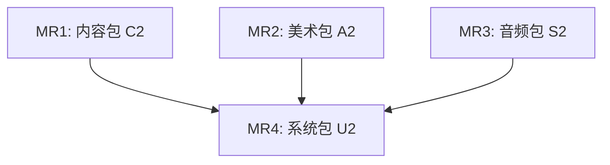

# 《环球航商》v0.2 需求规格

| 字段 | 内容 |
|------|------|
| 文档编号 | REQ-v0.2 |
| 版本 | v0.1（初稿） |
| 产品 | 《环球航商》/ Airborne Trader |
| 关联 | [PRD_01.md](../PRD_01.md) §13–14 / §19 / §24–25；[CONTENT_ASSET_SPEC.md](CONTENT_ASSET_SPEC.md) §0.3 / §1.2.F / §2.2；设计稿 `docs/superpowers/specs/2026-07-26-trade-feedback-and-anchors-design.md`、`2026-07-26-trade-flight-ux-design.md` |
| 引擎 | Godot 4.x |
| 语言 | 简体中文（主）；英文键名与资源 ID 使用 ASCII |
| 状态 | 需求定稿中 |

本文档定义 **v0.2 内容扩充里程碑** 的产品、内容、美术、音频与系统需求。与 PRD 冲突时以 PRD 玩法/法律约束为准；表现层规格以 [CONTENT_ASSET_SPEC.md](CONTENT_ASSET_SPEC.md)（下称 CAS）为准；本文件补充 v0.2 增量范围与验收标准。

---

## 1. 范围总览与分期定义

### 1.1 产品定位（不变）

**「可旋转的真实世界航线图鉴」**——清晰、可信、略带旅途温度。v0.2 在 Demo 已验证的「读城市—买商品—选航班—加速—过场—异地销售」闭环上，把世界从 20 座枢纽扩到全球可玩规模，并补齐图鉴感、反馈感与收集感。

### 1.2 v0.1（Demo）已交付回顾

对齐 PRD §24 / §27 与 CAS §0.5：

| 域 | 已交付 | 占位 / 未做 |
|----|--------|-------------|
| 地图与机场 | 3D 地球、20 枢纽、搜索/随机、大圆弧 | 正式 `EARTH_ALBEDO`、经纬网格、小飞机图标 |
| 航班与时间 | UTC 时钟、全局检索、经济/公务、加速、强制登机、5s 过场 | 过场仍为文案+SFX 占位；无中转/联程 |
| 贸易 | 每城 ≥5 商品、买卖、行李扩展/货运、存档 | 无价格锚点情报、无出售分级反馈、无惊喜事件 |
| 文本 | UI 中文、20 城七字段、100 商品描述、数据来源页 | 无 500+ 城文案 |
| 美术 | 基础 Theme + 字体 | 无城市头图、无商品独特图标、无成就图标 |
| 音频 | `bgm_globe_day` + P0 SFX 17 项 | 无 `bgm_market` / `bgm_menu` / `bgm_night`；无贸易反馈 SFX |

### 1.3 v0.2 目标一句话

在 **全球主要商业机场可旅行** 的前提下，交付 **500+ 重点城市内容包**、**城市/商品/成就视觉图鉴**、**区域 BGM 变奏**、**贸易反馈与价格锚点系统**、**中转/联程与航线推荐**，使单局可持续探索数十小时而不重复 Demo 的「小世界感」。

### 1.4 范围边界

#### 1.4.1 纳入（In Scope）

| # | 能力 | 来源 |
|---|------|------|
| C1 | 500+ 重点城市文案与商品配置；城市—区域—国家商品继承 | PRD §25 / §26 第五阶段 |
| C2 | 全部可查看机场；有定期客运航班的商业机场可旅行 | PRD §25 |
| C3 | 中转 / 联程航班（最小可用：单中转、最小转机时间） | PRD §25 |
| C4 | 基于价格锚点的航线 / 目的地推荐 | PRD §25 + 锚点设计 |
| A1 | 城市头图（插画或授权摄影） | CAS §0.3 / §1.2.F |
| A2 | 商品图鉴独特图标（非品牌包装） | CAS §0.3 / §1.2.F |
| A3 | 成就图标与成就系统 UI | CAS §0.3；PRD §19 / §25 |
| A4 | 贸易反馈相关图标、头像、粒子、横幅、弹窗壳 | 锚点设计 §5 |
| S1 | 区域主题变奏 BGM：`bgm_market` / `bgm_menu` / `bgm_night` | CAS §2.2 |
| S2 | 贸易反馈 SFX（亏损/大赚/大满贯/现金滚动） | 锚点设计 §5.5 |
| U1 | 区域价格锚点 hot / normal / cold | 锚点设计 §1 |
| U2 | 市场内嵌情报（免费标签 + $200 精准预测） | 锚点设计 §2 |
| U3 | 航行笔记 Tab | 锚点设计 §2.3 |
| U4 | 四种惊喜事件 | 锚点设计 §3 |
| U5 | 五级出售反馈 + 现金滚动 | 锚点设计 §4 |
| U6 | 买卖数量 SpinBox + 1/10/100；航班 &lt;2h 灰显与默认聚焦 | 航班 UX 设计 |
| U7 | 贸易合约目录（禁纪念品级磁铁等；合约重量与定价尺度） | 航班 UX 设计 |
| G1 | 成就系统（探索 / 贸易 / 飞行 / 收集） | PRD §19 / §25 |

#### 1.4.2 明确不纳入（Out of Scope → v0.3 / v1.0）

| 项 | 归属 |
|----|------|
| 经停航班细节、头等舱、延误/取消、航空联盟、MCT 精细表 | v0.3 |
| 冰鲜/冷藏行李、危险品/禁运品细化规则 | v0.3 |
| 授权完整历史时刻表、全年季节、Steam 成就云同步 | v1.0 |
| 多语言 UI / 城市正文翻译 | v1.0（结构按 CAS §3.8 预留） |
| 真实航司 Logo、完整驾驶舱模拟、实时联网航班 | 永不进 Demo/v0.2 目标 |
| 情报购买、事件状态写入存档（本版事件为 ephemeral） | 锚点设计 Out of Scope |
| 修改 `EconomySystem` 核心定价公式本身（锚点只读消费） | 锚点设计 Out of Scope |

### 1.5 与 CAS / PRD 分期对齐

| 文档 | v0.2 对应表述 |
|------|----------------|
| CAS §0.3 | 城市插画、商品图鉴图标、成就图标；区域主题变奏 BGM；500+ 城扩展文案 |
| PRD §25 v0.2 | 500+ 城、全球主要商业机场、城市图片、商品图鉴、成就、更完整文化内容、航线推荐、中转/联程 |
| PRD §26 第五阶段 | 全部机场可查看；商业机场可旅行；500+ 城；区域商品继承；数据质量报告；许可证页更新 |

### 1.6 成功标准（产品层）

1. 玩家可从任意有客运航班的商业机场出发，经直飞或单中转到达网络内其它商业机场。  
2. 打开任意重点城市卡片可见头图 + 七字段文案 + 当地可交易商品图鉴图标。  
3. 市场标签能根据当前机票目的地给出 hot/normal/cold 方向提示；出售有分级反馈。  
4. 成就页可追踪探索/贸易/飞行/收集进度，解锁时有图标与短提示。  
5. 数据来源页覆盖新增素材许可（城市图、商品图、成就图、新增音频）。  
6. 1080p 推荐配置下，远景机场层级策略生效，地球漫游仍可达约 60 FPS（标签 ≤200、同时航线显示上限可配置）。

---

## 2. 内容扩展：500+ 城市与全商业机场

### 2.1 数据范围定义

#### 2.1.1 机场分层（运行时可旅行性）

| 层级 | 定义 | 玩家可做什么 |
|------|------|----------------|
| L0 可查看 | OurAirports 全量（或子集）坐标点 | 搜索、点击、看资料；无客运航班则警告（PRD §9.2） |
| L1 可旅行 | 有定期客运航班、进入 v0.2 航班库的商业机场 | 作为起降点购票、加速、登机 |
| L2 重点城市 | 绑定完整百科文案 + 头图 + 本地商品配置的城市 | 图鉴完整体验 |
| L3 Demo 枢纽 | 原 20 座；文案与玩法已齐，作回归金样 | 兼容 v0.1 存档路径（若有） |

**数量目标：**

| 实体 | Demo | v0.2 目标 |
|------|------|-----------|
| 重点城市（L2） | 20 | **≥500** |
| 可旅行商业机场（L1） | 20 | **全球主要商业机场**（以 ETL 报告中「有 ≥1 条出港客运实例」为准；建议 ≥800 IATA 有客运机场，最终以数据质量门控为准） |
| 可查看机场（L0） | 20 | **全库可查看**（按缩放层级显示） |
| 城市商品条目 | ≥100 | 枢纽 8–15 / 普通 4–8 / 小型 ≥3；不足时区域/国家继承 |

#### 2.1.2 重点城市遴选规则（优先级）

1. Demo 20 枢纽保留。  
2. 各国首都 / 最大客运机场服务城市。  
3. 区域贸易节点（港口、自贸区、特产产地）。  
4. 航线图上连接度高的中转城。  
5. 内容可写性：Wikidata 有足够结构化事实（坐标、人口档、国家）。  

ETL 输出 `etl/out/coverage_report.json`（或等价）：城市数、L1 机场数、缺文案列表、缺商品列表、许可哈希。

### 2.2 ETL / 数据管线需求

```text
原始 CSV/API
→ 机场标准化 + 客运可用性标记
→ 城市映射（一城多场 / 一场多城）
→ 500+ 城内容合并（JSON）+ 区域/国家商品继承
→ 航班实例（直飞 + 单中转展开或运行时拼装）
→ 价格物化 + product_market_tags（hot/normal/cold）
→ 质量门控 → world.json / flights_*.json|sqlite
```

**新增或强化产物：**

| 产物 | 说明 |
|------|------|
| `product_market_tags` | 见 §5.1；写入 `world.json` |
| `cities/{city_id}.json` | ≥500；字段见 §2.3 |
| `products` + 继承表 | 城市级覆盖区域/国家默认 |
| `transfer_edges` 或运行时联程索引 | 支持 §2.5 |
| `coverage_report` | CI 可断言 |

Godot 运行时仍以验证后的 JSON（及按需 SQLite）只读加载；不在客户端清洗原始航线 CSV。

### 2.3 城市文本需求

字段与字数对齐 PRD §13 / CAS §3.2.3：

| 字段 | 汉字字数 | 要求 |
|------|----------|------|
| `short_description` | 80–150 | 卡片摘要 |
| `overview` | 150–300 | 航线节点定位 |
| `history_summary` | 100–250 | 史实向 |
| `geography_summary` | 80–200 | 气候地貌与旅行影响 |
| `economy_summary` | 80–200 | 产业与贸易气质 |
| `food_summary` | 80–200 | 合法食品/特产 |
| `travel_note` | 50–150 | 实用提示 |

**强制：**

- 基于 Wikidata 等 CC0/可商用结构化事实 **重新撰写**；禁止整段复制 Wikipedia（CC BY-SA）。  
- 每城：`source_ids`、`content_confidence`（A/B/C）、`image_asset_id`（指向 §3.1）。  
- 语气：冷静、博闻、旅行向；称呼「你」；禁歧视/政治动员/虚假官方合作（CAS §3.1）。  
- Demo 20 城须回归通过既有 content 测试；新增城同一 schema。

**产能策略（需求约束，非实现细节）：**

- 允许「编辑模板 + 事实槽位」辅助，但交付物必须通过人工抽检（每批 ≥10% 全字段审读）。  
- `content_confidence=C` 的城市可进游戏，但百科页须显示「模型/资料不足」等价提示（玩家可读）。

### 2.4 商品与贸易合约目录

对齐 PRD §14、CAS §3.2.4、航班 UX 设计决议：

| 项 | Demo | v0.2 |
|----|------|------|
| 品类定位 | 轻量特产为主 | **贸易合约 / 大宗与样品混合**；禁止 `纪念品` 磁铁级无贸易感条目作为主库 |
| 每城数量 | ≥5 | 枢纽 8–15；普通 4–8；小型 ≥3；否则继承 |
| `weight_kg` | 多数很轻 | 合约约 **10–50 kg**；样品/高价值器件可更轻（须标注类别） |
| 基准价 | 数十美元级常见 | 数百–数千 USD 常见，与 `$50,000` 起始资金匹配 |
| 图标 | 色块/首字占位 | **独特图鉴图标**（§3.2） |
| 名称 | 通用类别名 | 继续禁用未授权商标作主名 |

**允许类别（示例枚举）：** 食品、香料、茶叶、咖啡、糖果、工艺品、纺织品、陶瓷、文具、玩具、日用品、机械、能源、电子、矿产。  

**禁售：** 酒烟药武、活体、濒危制品、赌博物品、易燃易爆等（PRD §14.1）。

**继承规则：**

```text
CityProduct 覆盖 → RegionDefault → CountryDefault
```

继承商品在 UI 标注「区域特色 / 国家标准品」之类中性标签（文案 key 纳入 i18n）。

**描述：** 40–120 字；非模板化；含保存/贸易趣味；过期与易碎字段完整。

### 2.5 航线网络：直飞 + 中转 / 联程

#### 2.5.1 直飞

- 延续 Demo：OpenFlights/拟真重建时刻；界面强制声明不变。  
- L1 机场出港须满足覆盖门控（如每枢纽最少目的地数可配置；Demo 的 `min_destinations_per_hub: 8` 对大型枢纽可提高）。

#### 2.5.2 单中转联程（v0.2 最小集）

| 规则 | 要求 |
|------|------|
| 段数 | 最多 **2 段**（1 个中转） |
| 转机时间 | 到达后 ≥ 机场默认 MCT（无表时用全局默认，如 90 分钟）；上限可配置（如 8 小时） |
| 票价 | 两段经济舱之和 × 联程系数（建议 0.85–1.0，可配置）；公务舱仍为经济联程价 ×10 或分段公务之和取设计选定一种并写死 |
| 行李 | 全程按 **最严段** 额度；扩展/货运按行程一次购买 |
| 过场 | 每段仍 5s 过场，或「段1过场 → 短转机提示 → 段2过场」；总动画时长可配置但须有进度可读 |
| UI | 航班行显示 `A → hub → B`、总时长、总价、中转城市 |
| 声明 | 联程为重建网络上的合理拼装，不代表真实联程票 |

**不做（本版）：** 多中转、共享代码联营细节、机型限制、值机截止硬拦截（&lt;2h 仅灰显，仍可购——见 §5.6）。

### 2.6 航线 / 目的地推荐

依赖 §5.1 `product_market_tags`：

| 推荐位 | 行为 |
|--------|------|
| 市场「无票」时 | 显示该商品最佳 hot 目的地（已有免费标签逻辑） |
| 航班面板 | 可选排序：**预估贸易利润**（当前库存 × 目的地 sell 估计 − 票价粗估） |
| 「推荐航线」入口 | 给出 Top N（如 5）目的地：综合 hot 标签命中数、直飞优先于中转、票价摩擦 |

推荐文案须克制，禁止「稳赚」「内幕」类违规表述。

### 2.7 文本与数据验收（内容）

- [ ] L2 城市 ≥500，七字段达字数下限；`source_ids` / `content_confidence` 齐全  
- [ ] L1 机场可旅行；无航班机场走 PRD §9.2 警告流  
- [ ] 商品数量与继承规则满足 §2.4；无禁售类；无纪念品主库  
- [ ] `product_market_tags` 覆盖每个 origin\|product 与全部 L2 目的城分类互斥且并集完整（相对当前世界城市集）  
- [ ] 单中转联程可检索、可购、可飞完并结算  
- [ ] 数据来源页更新城市/商品规模说明；ODbL 等义务仍完整  
- [ ] `coverage_report` 进入 CI：缺文案/缺商品失败阈值可配置（建议阻断 `confidence` 空洞超标）

---

## 3. 美术资产需求

风格、色板、命名、导出格式 **继承 CAS §1**；本章只列 v0.2 增量与缺口关闭项。

### 3.1 城市头图（P0 · v0.2）

| ID 模式 | 规格 | 说明 |
|---------|------|------|
| `city_{city_id}_hero` | **1280×720**，PNG/WebP，sRGB | 插画或授权摄影；**无水印**；无未授权商标招牌特写 |
| 构图 | 横向 16:9 | 天际线 / 地标剪影 / 港口或航站外景气质；克制人物面孔 |
| 安全区 | 底部 20% | 可叠城市名与短描述，避免关键地标被裁切 |
| 许可 | 原创 / CC0 / 已购授权 / 明确可商用 | 写入 attribution；禁止不明来源爬图 |

**数量：** 每个 L2 城市 **1** 张主头图。允许「区域通用底板 + 色调」过渡，但验收前须替换为城特定或明确标为「临时通用」（不得超过 L2 的 15%，且不得用于 Demo 20 城）。

**目录：** `game/assets/cities/`  
**命名：** `city_{city_id}_hero_720.webp`（或 `.png`）

绑定字段：城市 JSON `image_asset_id`。

### 3.2 商品图鉴图标（P0 · v0.2）

| 项 | 要求 |
|----|------|
| 尺寸 | **64×64** 主图标；可选 @2x 128×128 |
| 风格 | 静物插画、柔和投影、白/浅灰底；线面结合，与 CAS 图标体系协调 |
| 内容 | **每商品独特**；表现品类与产地气质；**非品牌包装照**、无条码/Logo |
| 禁止 | 酒瓶烟盒药瓶枪械；写实血腥 |
| 格式 | SVG 源（可选）+ PNG/WebP 入库 |
| 目录 | `game/assets/products/` |
| 命名 | `product_{product_id}_64.png` |

UI：市场行、库存行、图鉴页使用同一图标；缺失时回退类别色块+首字（仅开发期）。

### 3.3 成就图标（P0 · v0.2）

| 项 | 要求 |
|----|------|
| 尺寸 | **64×64** 成就墙；列表可用 32×32 |
| 风格 | 与 CAS §1.2.E 一致：线面结合、笔画 1.5–2px、圆角端点 |
| 状态 | `locked`（低饱和剪影）/ `unlocked`（彩色）同一构图两态，或程序着色 |
| 目录 | `game/assets/icons/achievements/` |
| 命名 | `icon_ach_{achievement_id}_64.png` |

成就 ID 与文案见 §6。每条成就 1 图标（可共享基底变体色）。

### 3.4 贸易反馈与情报 UI 美术（P0 · 随 U1–U5）

对齐锚点设计 §5：

#### 3.4.1 图标

| Asset ID | 尺寸 | 说明 |
|----------|------|------|
| `icon_intel_upgrade` | 24×24 | 放大镜+星点；精准预测按钮 |
| `icon_notes_tab` | 24×24 | 笔记/手册；航行笔记 Tab |
| `icon_hot_tag` | 16–24 | 热卖向；青绿倾向，勿纯红误作警告 |
| `icon_cold_tag` | 16–24 | 不建议向；警示三角或雪花，红色倾向 |
| `icon_loading_globe` | 48×48 | 可循环；出售「市场处理中」0.5s |

#### 3.4.2 角色表情（Emoji 风格即可）

| Asset ID | 表情 | 尺寸 | 用途 |
|----------|------|------|------|
| `portrait_worried` | 担忧 / 扶额 | 64×64 | 出售 L2 大亏 |
| `portrait_celebrating` | 欢呼 | 64×64 | 出售 W2 大满贯 |

气质：旅行商人，非卡通吉祥物抢戏地球（CAS §0.4）。

#### 3.4.3 粒子与叠加

| Asset ID | 说明 | 用途 |
|----------|------|------|
| `particle_paper_shred` | 灰白碎纸，20–30 | L2 |
| `particle_coin` | 金币 ~16×16，弧线 | W1 |
| `particle_coin_rain` | 更密金币雨 50–80 | W2 |
| `overlay_gold_flash` | 全屏金闪，进→0.5s 淡出 | W2 |

可用程序粒子 + 少量贴图；须支持「减少动态」关闭脉冲/粒子（保留色状态）。

#### 3.4.4 横幅与弹窗

| Asset ID | 文案/用途 |
|----------|-----------|
| `banner_grand_slam` | 「大满贯！」金渐变条 |
| `banner_discovery` | 「发现者加成」紫/青渐变条 |
| `banner_wealth_milestone` | 「财富里程碑！」Toast |
| `event_popup_bg` | 80% 暗底 + 圆角卡片框；四类事件共用 |

### 3.5 Demo 遗留美术关闭（建议同里程碑，可标 P1）

若不做则保持 CAS §0.5 占位，但 v0.2「图鉴感」会打折：

| ID | 建议 |
|----|------|
| `EARTH_ALBEDO` | 2048×1024 或 4096×2048 正式贴图 |
| `anim_flight_*` | 过场三段视觉统一风格（插画帧或运动图形） |
| CAS §1.2.E 全套 Tab 图标 | 若 Demo 仍缺，本版补齐 |
| `logo_*` / `splash` | P1 品牌包 |

### 3.6 美术验收清单（v0.2）

- [ ] ≥500 城头图绑定且无水印；许可进 attribution  
- [ ] 每个可交易 `product_id` 有独特 64 图标；抽检无品牌包装  
- [ ] 成就图标 locked/unlocked 可辨  
- [ ] 情报/笔记/hot/cold 图标与 Theme 色板一致  
- [ ] L2/W2 反馈资产齐全；减少动态时不崩溃  
- [ ] 命名符合 CAS `{domain}_{object}_{variant}_{size}`；无中文文件名  

---

## 4. 音频需求

气质与总线 **继承 CAS §2**；本章为 v0.2 增量。

### 4.1 区域主题变奏 BGM（P0）

| ID | 场景 | 时长 | 纹理 | 循环 | Duck | 响度 |
|----|------|------|------|------|------|------|
| `bgm_market` | 市场 / 城市阅读 | 1:30–2:30 | globe 弱变奏；少 80Hz 以下 | 无缝 | 买卖 SFX 不 duck | −16 LUFS |
| `bgm_menu` | 新游戏 / 设置 / 成就墙 | 1:00–2:00 | 更慢更静 | 无缝 | 无 | −18 LUFS |
| `bgm_night` | 当地夜时（可选触发） | 同 day | 低通更暗 | 同 day | 同 day | −16 LUFS |

切换规则：

- 进入市场 Tab 或城市百科深读：`globe_day` → `market`（1–2s 交叉淡化）。  
- 主菜单 / 成就：`menu`。  
- 夜时变奏：根据当地小时（如 22:00–05:00）切换 `night`；可设置关闭。  
- 过场：Transition 总线播放时 BGM −6 dB（CAS §2.4）。

格式：Ogg Vorbis 48 kHz stereo；写入 `AUDIO_MANIFEST.csv`；CC0/CC-BY 须进 attribution。

### 4.2 贸易反馈 SFX（P0）

| ID | 触发 | 时长 | 峰值建议 | 备注 |
|----|------|------|----------|------|
| `sfx_loss` | 出售 L2 | ~0.3s | −10 dBFS | 低沉下行；勿警笛 |
| `sfx_loss_light` | 出售 L1 | ~0.15s | −14 dBFS | 轻触失败感 |
| `sfx_big_win` | 出售 W1 | ~0.5s | −10 dBFS | 上行钟+轻币声 |
| `sfx_grand_slam` | 出售 W2 | ~1.0s | −8 dBFS | 短Fanfare；勿赌场连击 |
| `sfx_coin_roll` | 现金数字滚动 | 可循环短垫 | −16 dBFS | 可关 |

音高关系相对：`grand_slam` / `big_win` > `sell` > `buy` > `loss_light` > `loss`（与 CAS `sell`>`buy`>`error` 一致扩展）。

### 4.3 音频验收

- [ ] 三首 BGM + 五条反馈 SFX 文件与 Manifest 一一对应  
- [ ] 场景切换无爆音；长时间市场界面不疲劳  
- [ ] 静音与分轨音量仍生效  
- [ ] 许可写入数据来源页  

---

## 5. UX 与系统增强

本章需求来自已批准设计：`trade-feedback-and-anchors-design`、`trade-flight-ux-design`。实现时以设计稿细节为准；本文给出产品级验收定义。

### 5.1 区域价格锚点（risk_profile）

**问题：** 日波动与需求衰减使「飞对城市」不可信。  

**方案：** ETL 对每个 `(origin_product, dest_city)` 计算 `sell_buy_ratio`，写入 `world.json`：

```json
{
  "product_market_tags": {
    "beijing|steel_pipes": {
      "hot": ["dubai", "frankfurt"],
      "normal": ["singapore", "london"],
      "cold": ["bangkok", "los_angeles"]
    }
  }
}
```

| sell_buy_ratio | Tag | 玩家语义 |
|----------------|-----|----------|
| ≥ 1.15 | hot | 最差合理噪声下仍大概率毛利为正 |
| 1.00–1.14 | normal | 方向对，但可能翻车 |
| &lt; 1.00 | cold | 大概率亏 |

公式复用现有 ETL 买卖价物化，不另起一套经济模型。运行时 **只读** 标签；不改核心定价公式。

### 5.2 市场内嵌情报

#### 5.2.1 免费标签

在市场商品行，相对 **当前已购机票目的地**：

| 状态 | 标签 | 色 |
|------|------|-----|
| 目的地 hot | 📍{城}热卖 | 绿 / teal |
| 目的地 normal | 📍{城}可售 | 主文字色 |
| 目的地 cold | ⚠️不建议 | 警告红 |
| 无票 | ⭐最佳目的地：{城} | 琥珀/金 |

#### 5.2.2 付费精准预测

- 按钮：`🔍精准预测`，费用 **$200**（可配置常量）。  
- 条件：已持票；资金足够。  
- 效果：替换免费标签为 **预计毛利区间** `$low–$high`（基于 `sell_price` 估计 ± 日波动幅度）。  
- 有效期：至该票使用或退票；**不强制写入存档**（本版）。

### 5.3 航行笔记 Tab

- 位置：库存旁新 Tab「笔记」。  
- 内容：按出售城市分组的成交记录（商品、数量、毛利、时间）；城汇总「x赚 y亏 净利」。  
- 只读；无玩法数值加成。  
- 数据：`AppState.sell_transactions`（是否入存档：若入档须在存档 schema 注明；设计稿默认可不持久化事件，但笔记建议可随存档保留——**本需求指定：笔记交易日志随存档保存**，事件弹窗状态仍不保存）。

### 5.4 惊喜事件（四种）

共用 `PopupEvent`；种子 `hash(city + date_hour + product + event_type)`；离城清空 ephemeral 状态。

| 事件 | 触发 | 概率 | 要点 |
|------|------|------|------|
| 到达折扣 | 抵达 | 20% | 一商品 −20%～−40%；本城停留有效；最多 1 次/抵达 |
| 免费货运 | 抵达或购票后 | 10% | 本航次 +50kg cargo 费用 0 |
| 意外溢价 | 点出售确认后、入账前 | 5–10% | +20%～+35%；不可取消；可抬升 W2 |
| 城市独家发现 | 在 cold 城卖出成功且仍有库存 | 5% | 剩余同商品 ×2.0 一键卖出或暂存至离城；每城停留最多 1 次 |

文案语气保持旅行向，避免赌博/开箱感过重；SFX/BGM 禁止赌场连击（CAS §2.1）。

### 5.5 五级出售反馈 + 现金滚动

流程：确认 → 0.5s「市场处理中」→ 结果卡（1–3s）→ 关闭 → 现金 ease-out 滚动 ~1s。

| Tier | 条件 | 视觉要点 | 音频 | 时长 |
|------|------|----------|------|------|
| L2 大亏 | margin &lt; 0 且 rate &lt; −20% | 红卡 + 灰碎纸 + 担忧头像 + 安慰文案 | `sfx_loss` | 2.5s |
| L1 小亏 | margin &lt; 0 且 rate ≥ −20% | 浅红 + 提示换市场 | `sfx_loss_light` | 1.5s |
| W0 普通赚 | 0 ≤ margin &lt; $3,000 | 绿字轻弹 | 现有 `sfx_sell` | 1.0s |
| W1 大赚 | $3,000 ≤ margin &lt; $10,000 | 金绿卡 + 金币粒子 | `sfx_big_win` | 2.0s |
| W2 大满贯 | margin ≥ $10,000 **或** 意外溢价 | 金闪 + 金币雨 + 横幅；发现者加成可叠 | `sfx_grand_slam` | 3.0s |

结果卡次行可显示行程净利（毛利 − 本趟机票 − 行李/货运）。  
财富里程碑 Toast：现金 ≥ $100,000 或较开局翻倍。  
安慰/庆祝文案池进 `zh_CN.csv`（设计稿已列 key）。

「减少动态」：关闭粒子/闪光/脉冲，保留颜色与文案。

### 5.6 买卖数量与航班列表 UX

| 项 | 要求 |
|----|------|
| 数量 UI | SpinBox 1–9999；快捷 **1 / 10 / 100**；调用现有 `buy/sell(qty)` |
| &lt;2h 航班 | **仅灰色样式**；仍可购买；**不**做 TicketService 硬截止 |
| 默认聚焦 | 打开航班面板时，选中/滚动到首个起飞领先 ≥ **7200s（2h）** 的航班；更早航班仍可见 |

### 5.7 起始资金与合约尺度

| 项 | 值 |
|----|-----|
| 起始现金 | **$50,000** USD（`economy.yaml` `starting_cash_usd`） |
| 展示 | `EconomySystem.format_money`；内部结算 USD |
| 目录 | 见 §2.4；重建 `world.json` 后回归 trade 单测 |

### 5.8 UX 验收清单

- [ ] hot/normal/cold 与 ETL 阈值一致；标签随购票目的地更新  
- [ ] $200 预测扣款与区间显示正确；无票时拒绝并提示  
- [ ] 笔记 Tab 按城汇总；存读档后记录仍在  
- [ ] 四类事件概率与互斥规则手测可复现（同种子）  
- [ ] 五级反馈阈值可测；减少动态可用  
- [ ] SpinBox/快捷数量；&lt;2h 灰显；默认聚焦 ≥2h  
- [ ] 无赌场式音效与违规文案  

---

## 6. 成就系统

### 6.1 目标

把「访问、贸易、飞行、收集」做成轻量长期目标，强化图鉴感；**非** Steam 云成就（那是 v1.0）。本版为 **游戏内成就墙**。

### 6.2 分类

| 类别 | ID 前缀 | 主题 |
|------|---------|------|
| 探索 | `ach_explore_*` | 城市/国家/机场访问 |
| 贸易 | `ach_trade_*` | 利润、亏损、品类、情报 |
| 飞行 | `ach_flight_*` | 航程、舱位、联程、准点登机 |
| 收集 | `ach_collect_*` | 商品图鉴、笔记城数、头图城市 |

### 6.3 成就清单（v0.2 最低集）

进度类成就须可显示 `current/target`。

#### 6.3.1 探索

| ID | 名称 | 条件 |
|----|------|------|
| `ach_explore_first_city` | 初航 | 抵达第 2 座不同城市（含起点后的首次抵达） |
| `ach_explore_cities_10` | 十城记 | 已访问城市 ≥10 |
| `ach_explore_cities_50` | 五十城 | ≥50 |
| `ach_explore_cities_100` | 百城旅人 | ≥100 |
| `ach_explore_cities_500` | 环球航商 | ≥500（或当前 L2 总数若 &lt;500 则以 L2 全解锁为准） |
| `ach_explore_countries_10` | 十国通行 | 已访问国家/地区 ≥10 |
| `ach_explore_countries_30` | 三十国 | ≥30 |
| `ach_explore_hubs_20` | 枢纽巡礼 | Demo 20 枢纽全部访问 |
| `ach_explore_extreme_ns` | 极向旅者 | 到访过数据集中最北与最南可旅行机场各至少一次 |
| `ach_explore_extreme_ew` | 经线旅者 | 最东与最西可旅行机场各一次 |

#### 6.3.2 贸易

| ID | 名称 | 条件 |
|----|------|------|
| `ach_trade_first_profit` | 第一桶金 | 单笔出售毛利 &gt; 0 |
| `ach_trade_profit_10k` | 万元户 | 单笔毛利 ≥ $10,000（常与 W2 同期） |
| `ach_trade_net_100k` | 资本积累 | 现金 ≥ $100,000 |
| `ach_trade_big_loss` | 交学费 | 单笔触发 L2 大亏 |
| `ach_trade_hot_streak` | 热卖直觉 | 累计在 hot 目的地成交 ≥20 笔 |
| `ach_trade_intel` | 情报贩子 | 购买精准预测 ≥10 次 |
| `ach_trade_discovery` | 发现者 | 触发一次城市独家发现并完成溢价卖出 |
| `ach_trade_categories_8` | 百货通 | 至少 8 个商品类别各售出过 1 次 |

#### 6.3.3 飞行

| ID | 名称 | 条件 |
|----|------|------|
| `ach_flight_first` | 起飞 | 完成 1 次登机到达 |
| `ach_flight_10` | 常旅客 | 完成航班段 ≥10 |
| `ach_flight_50` | 空中积家 | ≥50 |
| `ach_flight_distance_40k` | 环球距离 | 累计飞行距离 ≥ 40075 km（地球周长量级） |
| `ach_flight_business` | 公务一回 | 以公务舱完成 1 段 |
| `ach_flight_cargo` | 货舱商人 | 使用货运额度完成 1 段到达 |
| `ach_flight_connection` | 转机达人 | 完成 1 次联程行程 |
| `ach_flight_ff` | 时间旅行者 | 使用「加速至起飞」≥20 次 |
| `ach_flight_on_time` | 从不误机 | 连续 10 次在强制登机前已在机场界面（或未触发「错过」流）——若 Demo 无「错过」则改为「从未在登机遮罩外被强制打断市场操作」并在实现时定义可测事件 |

#### 6.3.4 收集

| ID | 名称 | 条件 |
|----|------|------|
| `ach_collect_products_50` | 货册初成 | 图鉴发现商品种类 ≥50 |
| `ach_collect_products_200` | 货册丰盈 | ≥200 |
| `ach_collect_notes_20` | 交易手账 | 笔记中不同出售城 ≥20 |
| `ach_collect_heroes_50` | 城市明信片 | 已访问且拥有头图的城市 ≥50（即访问 L2） |

### 6.4 数据与存储

```text
achievement_id
name_zh
description_zh
category
target_value          # 进度类；瞬时类 = 1
stat_key              # 绑定统计计数器
icon_asset_id
hidden                # 可选：未解锁仅显示「???」
```

- 进度统计进入存档。  
- 解锁时：Toast + SFX（可用 `sfx_arrive` 或新增 `sfx_achievement`，P1）+ 图标亮起。  
- 成就墙：按四类分页；支持筛选未解锁/已解锁。

### 6.5 文案与法律

- 成就描述不暗示真实航司合作或真实购票。  
- 不使用未授权商标。  
- i18n key：`ach.{id}.name` / `ach.{id}.desc`。

### 6.6 成就验收

- [ ] §6.3 最低集全部可解锁且可回归（单测或脚本模拟统计）  
- [ ] 图标与 locked 态齐全  
- [ ] 存读档进度不丢  
- [ ] 解锁提示不阻断时间规则（除设置暂停）  

---

## 7. 附录

### 7.1 须同步更新的既有文档

| 文档 | 更新点 |
|------|--------|
| [CONTENT_ASSET_SPEC.md](CONTENT_ASSET_SPEC.md) | §0.3 状态；§0.5 盘点改为 v0.2；§1.2.F 标为 P0；§2.2 BGM P0；新增成就/反馈资产表；§4.4 增加美术包 A2 / 音频包 A2 / 文本包 A2 |
| [PRD_01.md](../PRD_01.md) | §25 勾选范围与本 REQ 对齐；§26 第五阶段退出条件引用本文验收 |
| `attribution_zh.txt` | 城市图、商品图、新 BGM/SFX、字体若有新增 |
| `AUDIO_MANIFEST.csv` | 新音频行 |
| ETL `hubs_20.yaml` | 扩展为 `cities_500`（或分文件）配置源 |

### 7.2 里程碑交付包

#### 7.2.0 MR 依赖与数据流



- **C2 先行**（已合入）：U2 需要 `product_market_tags`、合约数据、联程索引。
- **A2 / AU 可并行**：纯资产入仓，不阻塞 C2；U2 引用资产 ID 但开发期可占位。
- **U2 收口**：消费所有前置包的产物。

#### 7.2.1 MR1：内容包 C2 ✅

**目标**：从 20 城扩展到 500+ 重点城市数据，引入合约目录、价格锚点、联程索引。

| 产出 | 说明 |
|------|------|
| `etl/scripts/run_pipeline.py` | 扩展：`build_cities_500_from_ourairports()`、`build_transfer_edges()`、`build_coverage_report()`、`PRODUCT_TEMPLATES`（15 类别）+ `generate_inherited_products()` |
| `game/data/world.json` | 新增字段：`product_market_tags`、`transfer_edges`、`coverage_report`；`airports.has_passenger_service`；`cities.image_asset_id` |
| 测试 | `test_v2_transfer_edges.py`（6 条）、`test_v2_coverage.py`（11 条）；现有 27 条回归通过 |

**交付规模**（默认 50 城，`--full` 支持 500+）：

| 维度 | 值 |
|------|-----|
| 城市 | 50（20 手写 + 30 模板，`--full` 可达 500） |
| 商品 | 250（100 手写 + 150 继承，15 类别） |
| 价格锚点对 | 12,500 |
| 联程中转对 | 1,116 |
| 管道耗时 | ~1.3s（50 城） |

#### 7.2.2 MR2：美术包 A2

**目标**：入库城市头图、商品图标、成就图标、反馈/情报相关图标与横幅粒子。

**依赖**：MR1（`city.image_asset_id` 字段、`coverage_report` 缺城列表）。

---

##### 2.1 城市头图

**目录**：`game/assets/cities/`（新建）  
**命名**：`city_{city_id}_hero_720.webp`（或 `.png`）  
**规格**：1280×720，sRGB，WebP / PNG，无水印。

**设计要求**（对齐 CAS §1.2.F）：横向 16:9，天际线/地标剪影/港口或航站外景气质；底部 20% 安全区可叠城市名与短描述；克制人物面孔。许可：原创 / CC0 / 已购授权 / 明确可商用。

**交付分期**：

| 批次 | 范围 | 数量 |
|------|------|------|
| P0 | Demo 20 枢纽 + 高优先级 L2 城 | ≥30 |
| P1 | 其余 L2 城（可使用区域通用底板 + 色调过渡） | 逐步补齐 |
| 占位 | 颜色底板 + 城市名 overlay | ≤L2 总数的 15%，不可用于 Demo 20 城 |

**文件变更**：

| 文件 | 变更 |
|------|------|
| `game/assets/cities/` | 新建目录，入库城头图 |
| `game/assets/i18n/attribution_zh.txt` | 补充城市图许可 |

**验收**：打开城市卡片可见头图或占位底图；无水印/商标侵权。

---

##### 2.2 商品图鉴图标

**目录**：`game/assets/products/`（新建）  
**命名**：`product_{product_id}_64.png`  
**规格**：64×64，静物插画，柔和投影，白/浅灰底，非品牌包装。

**设计要求**（对齐 CAS §1.2.F）：线面结合、与 IconFactory 体系协调；每商品独特、表现品类与产地气质；无酒瓶烟盒药瓶枪械、无条码/Logo。

**文件变更**：

| 文件 | 变更 |
|------|------|
| `game/assets/products/` | 新建目录，入库商品图标 |
| `game/themes/IconFactory.gd` | 新增 `get_product_icon(product_id: String) -> Texture2D`：优先 `game/assets/products/`，fallback 回类别色块+首字（当前 `MainHUD._add_market_row` 已用此模式） |

**验收**：市场列表中每个商品显示对应图标或 fallback 色块。

---

##### 2.3 成就图标

**目录**：`game/assets/icons/achievements/`（新建）  
**命名**：`icon_ach_{achievement_id}_64.png`  
**规格**：64×64 成就墙；列表可用 32×32。

**设计要求**（对齐 CAS §1.2.E）：线面结合、笔画 1.5–2px、圆角端点；`locked` 态低饱和剪影 / `unlocked` 态彩色，同一构图两态。可按成就类别共享基底变体色（如探索类同色调、贸易类同色调）。

**成就最低集**（对齐 §6.3，34 条分四类）：

| 类别 | 数量 | icon_ach 前缀示例 |
|------|------|-------------------|
| 探索 | 8 | `explorer_visit_*`, `explorer_continent_*` |
| 贸易 | 12 | `trader_profit_*`, `trader_hot_*` |
| 飞行 | 8 | `flyer_segment_*`, `flyer_extreme_*` |
| 收集 | 6 | `collector_category_*`, `collector_fortress_*` |

**文件变更**：

| 文件 | 变更 |
|------|------|
| `game/assets/icons/achievements/` | 新建目录，入库 34×2 图标 |
| `game/themes/IconFactory.gd` | 新增 `get_achievement_icon(ach_id: String, unlocked: bool) -> Texture2D` |

**验收**：每条成就至少有一个 locked 和一个 unlocked 图标。

---

##### 2.4 反馈与情报 UI 资产

**目录**：

| 路径 | 用途 |
|------|------|
| `game/assets/icons/` | `icon_intel_upgrade_24.png`、`icon_notes_tab_24.png`、`icon_hot_tag_16.png`、`icon_cold_tag_16.png`、`icon_loading_globe_48.png` |
| `game/assets/portraits/` | `portrait_worried_64.png`、`portrait_celebrating_64.png` |
| `game/assets/particles/` | 粒子贴图（或程序化，`FeedbackParticles.gd` 已存在） |
| `game/assets/banners/` | 横幅素材（可程序绘制） |

**图标清单**：

| Asset ID | 尺寸 | 说明 |
|----------|------|------|
| `icon_intel_upgrade` | 24×24 | 放大镜+星点；精准预测按钮 |
| `icon_notes_tab` | 24×24 | 笔记/手册；航行笔记 Tab |
| `icon_hot_tag` | 16–24 | 热卖向；青绿倾向，勿纯红误作警告 |
| `icon_cold_tag` | 16–24 | 不建议向；警示三角或雪花，红色倾向 |
| `icon_loading_globe` | 48×48 | 可循环；出售"市场处理中"0.5s |

**角色表情**（Emoji 风格即可）：

| Asset ID | 表情 | 尺寸 | 用途 |
|----------|------|------|------|
| `portrait_worried` | 担忧/扶额 | 64×64 | 出售 L2 大亏 |
| `portrait_celebrating` | 欢呼 | 64×64 | 出售 W2 大满贯 |

**粒子与叠加**：

| Asset ID | 说明 | 用途 |
|----------|------|------|
| `particle_paper_shred` | 灰白碎纸，20–30 片 | L2 亏损 |
| `particle_coin` | 金币 ~16×16，弧线 | W1 中等赚 |
| `particle_coin_rain` | 更密金币雨 50–80 | W2 大赚 |
| `overlay_gold_flash` | 全屏金闪，0s→0.5s 淡出 | W2 大满贯 |

**横幅与弹窗**：

| Asset ID | 文案/用途 |
|----------|-----------|
| `banner_grand_slam` | "大满贯！"金渐变条 |
| `banner_discovery` | "发现者加成"紫/青渐变条 |
| `banner_wealth_milestone` | "财富里程碑！"Toast |
| `event_popup_bg` | 80% 暗底 + 圆角卡片框；四类事件共用 |

**文件变更**：

| 文件 | 变更 |
|------|------|
| `game/themes/IconFactory.gd` | 扩展枚举（当前 19 个图标 → 扩充至含上述 5 个） |
| `game/assets/icons/` | 入库新图标 |
| `game/assets/portraits/` | 新建，入库角色表情 |
| `game/assets/particles/` | 新建，入库粒子贴图（或程序化，`FeedbackParticles.gd` 已支持 `ColorRect` 无外部贴图） |
| `game/assets/banners/` | 新建，入库横幅素材（可用 Label + StyleBoxFlat 程序绘制替代） |

**验收**：`IconFactory` 新图标可调用返回非 null；粒子/横幅在出售反馈中渲染无误。

---

##### 2.5 同步更新文档

| 文档 | 更新点 |
|------|--------|
| `docs/CONTENT_ASSET_SPEC.md` | §0.5 资产盘点表：A2 新增资产标为"已齐" |
| `game/assets/i18n/attribution_zh.txt` | 城市图、商品图许可声明 |

##### 2.6 MR2 提交

```bash
git add game/assets/cities/ game/assets/products/ game/assets/icons/achievements/
git add game/assets/icons/ game/assets/portraits/ game/assets/particles/ game/assets/banners/
git add game/themes/IconFactory.gd
git add docs/CONTENT_ASSET_SPEC.md game/assets/i18n/attribution_zh.txt
git commit -m "feat(v0.2): A2 art — city heroes, product icons, achievements, feedback assets"
```

#### 7.2.3 MR3：音频包 S2

| 交付物 | 路径 | 数量 |
|--------|------|------|
| `bgm_market` | `game/assets/audio/bgm/audio_bgm_market.ogg` | 1:30–2:30，−16 LUFS |
| `bgm_menu` | `game/assets/audio/bgm/audio_bgm_menu.ogg` | 1:00–2:00，−18 LUFS |
| `bgm_night` | `game/assets/audio/bgm/audio_bgm_night.ogg` | globe_day 低通版，−16 LUFS |
| `sfx_loss` | `game/assets/audio/sfx/audio_sfx_loss.ogg` | ~0.3s 低沉下行 |
| `sfx_loss_light` | `game/assets/audio/sfx/audio_sfx_loss_light.ogg` | ~0.15s 轻触失败 |
| `sfx_big_win` | `game/assets/audio/sfx/audio_sfx_big_win.ogg` | ~0.5s 上行钟+轻币 |
| `sfx_grand_slam` | `game/assets/audio/sfx/audio_sfx_grand_slam.ogg` | ~1.0s Fanfare |
| `sfx_coin_roll` | `game/assets/audio/sfx/audio_sfx_coin_roll.ogg` | 可循环短垫 |

变更文件：`AUDIO_MANIFEST.csv`、`AudioService.gd`、`attribution_zh.txt`。

#### 7.2.4 MR4：系统包 U2

消费 MR1/MR2/MR3 产物，实现 v0.2 全部 UX 增强。详见 `docs/superpowers/plans/2026-07-26-trade-feedback-and-anchors.md` Tasks 2–16。

### 7.3 总验收清单（发布门禁）

**内容**

- [ ] §2.7 全部勾选  

**表现**

- [ ] §3.6、§4.3 全部勾选  

**系统**

- [ ] §5.8、§6.6 全部勾选  

**回归**

- [ ] Demo §27 自动化（pytest + `demo_smoke_logic` + SmokeContent）仍通过  
- [ ] 20 枢纽金样航线/贸易无回归  
- [ ] 1080p 地球漫游性能目标（标签/航线上限策略生效）  
- [ ] 强制声明仍出现在底栏、购票、来源页、启动/菜单  

### 7.4 风险与依赖

| 风险 | 影响 | 缓解 |
|------|------|------|
| 500 城文案产能不足 | 延期 | 分批解锁 L2（先 100/250/500）；C 级置信度限流；继承商品顶住可玩性 |
| 城市图版权不清 | 法律 | 仅原创/明确授权；无来源不入库；attribution 门禁 |
| 全球机场渲染卡顿 | 体验 | 缩放层级 + MultiMesh 分桶；标签 ≤200；航线按需显示 |
| 联程组合爆炸 | 性能/UX | 仅单中转；搜索先直飞后联程；结果条数上限 |
| 锚点与体感不符 | 信任 | 调阈值前用报表抽检 hot 胜率；保留 normal 灰区 |
| 事件过频破坏节奏 | 疲劳 | 概率上限；同城互斥；设置可关「惊喜事件」 |
| 成就刷法破坏经济 | 平衡 | 成就无现金奖励；仅统计与图标 |

### 7.5 依赖技能与设计稿索引

| 主题 | 路径 |
|------|------|
| 价格锚点 / 情报 / 事件 / 出售反馈 | `docs/superpowers/specs/2026-07-26-trade-feedback-and-anchors-design.md` |
| 实现任务拆解 | `docs/superpowers/plans/2026-07-26-trade-feedback-and-anchors.md` |
| 数量 / 航班灰显 / 合约目录 | `docs/superpowers/specs/2026-07-26-trade-flight-ux-design.md` |
| 美术音频文本基线 | `docs/CONTENT_ASSET_SPEC.md` |
| 产品总纲 | `PRD_01.md` |

### 7.6 修订记录

| 版本 | 日期 | 说明 |
|------|------|------|
| v0.1 | 2026-07-27 | 初稿：汇总量产内容、CAS v0.2 资产、贸易反馈 UX、联程推荐与成就最低集 |
| v0.2 | 2026-07-27 | MR1 已交付：50 城基础、合约目录、产品继承、价格锚点、联程索引、覆盖率报告 — 61 测全过。§7.2 拆分为 MR1-MR4 详细交付规格。 |

---

**维护者：** 与程序仓库同仓维护。范围变更须同步 PRD §25 与 CAS §0.3；玩法数值变更须同步锚点设计稿与 ETL 单测。
